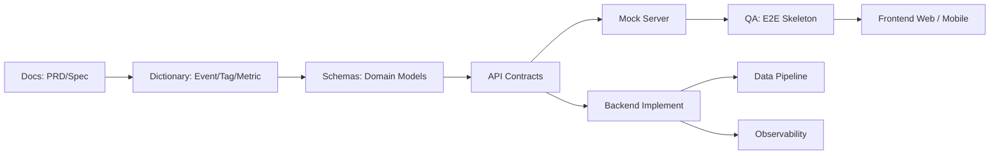

# {{PROJECT_NAME}} Project Playbook
> {{PROJECT_NAME}} — Repo 協作指南 / 工作流 / 邊界與限制

- **Version**：v1.2
- **Last Updated**：{{LAST_UPDATED}}（{{TIMEZONE}}）
- **GitHub Organization ID**：`{{GITHUB_ORG}}`
- **Core Method**：**Contract-first + Mock-first**
- **Audience**：PM / RD（Backend/Frontend/Mobile/Data/Platform）/ QA / AI Agents（Codex/LLM）

---

## 🚦 Start Here (快速導航)
本文件為專案協作總綱 (Constitution)。若需執行具體任務，請優先參考以下入口：

- **我是新人 (Member)**：我要在本機建立新專案  
  👉 `docs/new-project-sop.md`
- **我是 AI (Agent)**：我要執行初始化任務  
  👉 `aaa-tools/runbooks/init/AGENT_BOOTSTRAP.md`
- **Init DoD (最小驗收)**  
  - ✅ Repos 建立完成  
  - ✅ CI checks（lint/test/eval）通過  
  - ✅ `aaa-init-report.json` 產出並歸檔  

## Template Variables
- `{{PROJECT_NAME}}`: 專案名稱（例：PBOS）
- `{{PROJECT_PREFIX}}`: Repo 前綴（例：pbos）
- `{{GITHUB_ORG}}`: GitHub Organization ID（例：personal-body-os）
- `{{LAST_UPDATED}}`: 最近更新日期（例：2025-12-21）
- `{{TIMEZONE}}`: 時區（例：Asia/Taipei）
- `{{PROJECT_WORKSPACE}}`: 本機工作區資料夾名稱（例：PBOS_WORKSPACE）
- `{{DOMAIN_SIGNAL}}`: 核心資料物件名稱（例：Body Log）
- `{{CORE_ENGINE}}`: 核心運算/分析引擎名稱（例：PHAD）
- `{{DOMAIN_ENTITY}}`: 範例資料實體（例：BloodPressure）
- `{{DOMAIN_FIELD}}`: 範例欄位名稱（例：pulse）
- `{{DOMAIN_FIELD_UNIT}}`: 範例欄位單位（例：bpm）
- `{{DOMAIN_METRIC}}`: 範例指標名稱（例：caffeine_tolerance）
- `{{FRONTEND_CHART_LIB}}`: 前端圖表庫（例：Recharts）

## 目錄
1. 文件目的與範圍  
2. 專案核心協作哲學（Contract-first / Mock-first）  
3. Repo 地圖與責任邊界（Maximal Set）  
4. Single Source of Truth 規則（Contracts / Schemas / Dictionary / Design System）  
5. 團隊（Teams）與角色分工（含描述）  
6. 工作流（Feature / Bug / Breaking Change / Release）  
7. Git / PR 協作規範（含 PR 模板要求）  
8. QA / 測試策略與 DoD（Definition of Done）  
9. AI / Agent 協作規範（允許 / 禁止 / PR 要求）  
10. 資料、隱私與安全邊界（健康資料高風險）  
11. 本機開發基線（Ports / Env / Workspace Layout）  
12. GitHub 治理落地（.github 檔案、CODEOWNERS、權限、Branch Protection）  
13. 日常同步節奏（Sync / ADR）  
14. 附錄（Checklist / Labels / 快速配置步驟）

---

## 1. 這份文件的目的
{{PROJECT_NAME}} 是一個「生活資料流（{{DOMAIN_SIGNAL}}）+ 模式引擎（Pattern/{{CORE_ENGINE}}）+ 前後端產品」的長期專案。跨多 repo 與多角色協作，最大的風險往往不是技術，而是**定義不一致**與**協作失控**，例如：
- 每個人對 repo 的「定義」不同
- API / Schema / Dictionary 口徑不一致
- 前端等後端、後端等前端、QA 沒基準、AI agent 亂改
- 破壞性變更（Breaking Change）沒有治理，導致串接全面崩壞

本文件提供一套可執行的「共同語言」與「協作機制」：
- 12 repo 的**定位、邊界、責任**
- **Contract-first + Mock-first** 的協作模式
- 跨 repo 變更流程（誰先改、改哪裡、怎麼同步）
- PR/Branch/Release 工作流與品質門檻（QA / CI / Code Owners）
- Teams / 權限 / Branch Protection 的落地配置

## Governance Baseline (Required)
Before any repository goes active, ensure it complies with the org governance baseline:
- Branch protection on `main`
- Required checks via `aaa-actions` (lint/test/eval)
- Ownership & CODEOWNERS aligned with team model

Source of truth: `.github/GOVERNANCE.md`

---

## 2. 專案核心協作哲學
### 2.1 Contract-first（合約優先）
**API 與資料結構先定義、後實作**，避免「各端自行腦補」。
- API 以 `{{PROJECT_PREFIX}}-api-contracts` 為準（Single Source of Truth）
- Domain schema / 型別以 `{{PROJECT_PREFIX}}-shared-schemas` 為準
- 統一詞彙、事件、標籤、指標定義以 `{{PROJECT_PREFIX}}-data-dictionary` 為準
- UI tokens / primitives 以 `{{PROJECT_PREFIX}}-design-system` 為準

> 原則：先讓「接口與語言」穩定，才做服務與 UI。

### 2.2 Mock-first（先跑通流程）
在後端未完成之前，必須能用 `{{PROJECT_PREFIX}}-mock-server` 讓端到端流程跑通：
- Mobile → Sync → API → Dashboard/Report
- QA 可基於 Mock 合約做測試案例與驗收
- 前端可完成 UI 與整合，不被後端阻塞

> 原則：只要 contract 穩，任何一端都能獨立前進。  

> Mock-first 的核心產物：**可 demo、可測、可回歸**。


### 2.3 核心資料策略：為何需要嚴格治理？ (The "Why")
> **範例段落**：以下內容以健康資料專案為例（{{DOMAIN_SIGNAL}} / {{CORE_ENGINE}}）。請依你的領域替換為實際的核心價值與風險描述。

{{PROJECT_NAME}} 的本質不是一個 CRUD App，而是一個 **「核心產品系統 ({{PROJECT_NAME}})」**。我們的所有規範都是為了服務以下核心價值：

1.  **{{DOMAIN_SIGNAL}} (資料即訊號)**：
    * 我們記錄的不是死板的「表格」，而是連續的「身體訊號」。
    * **關聯性**：嚴格的 `{{PROJECT_PREFIX}}-shared-schemas` 確保了前端輸入的「咖啡」與後端分析的「咖啡因」是同一個語意實體。

2.  **{{CORE_ENGINE}} (模式引擎)**：
    * **Personal Health Anomaly Detection** 依賴高度結構化的資料來偵測 **「微模式 (Micro-patterns)」**。
    * *案例*：要偵測「每當晚餐吃辣 (Input) → 深層睡眠減少 (Output)」的關聯，依賴於 Input/Output 的資料定義絕對一致。
    * **風險**：如果 Mobile 端隨意發明 EventType，{{CORE_ENGINE}} 就會因資料雜訊而失效。

3.  **價值閉環 (The Value Loop)**：
    * `Contracts` 定義資料流管道 → `Pipeline` 清洗資料 → `{{CORE_ENGINE}}` 運算模式 → `Dashboard` 呈現洞察。
    * 任何一環的 **Schema 脫鉤 (Schema Drift)**，都會導致最終的洞察斷鏈。

> **結論**：我們遵守 Contract-first，不是為了官僚主義，而是為了**保護資料的可運算性 (Computability)**，讓 AI 能讀懂你的身體。

---

## 3. Repo 地圖與責任邊界（Maximal Set）
> 每個 repo 必須清楚「它做什麼 / 不做什麼」，避免責任漂移。
> 下表為全配版（Maximal Set），小型專案可依需求裁減或合併（例如 Backend + Schemas）。

| Repo | 定位 | 主要產物 | Owner（Team） | 不做的事（Boundary） |
|---|---|---|---|---|
| `{{PROJECT_PREFIX}}-docs` | 產品/技術文件中樞 | PRD、Specs、ADR、Playbook、Refs | `@{{GITHUB_ORG}}/pm` + `@{{GITHUB_ORG}}/architect` | 不放可執行服務、不放部署腳本 |
| `{{PROJECT_PREFIX}}-api-contracts` | API 合約唯一真相 | OpenAPI/GraphQL/Postman | `@{{GITHUB_ORG}}/backend` | 不寫業務邏輯、不放 UI |
| `{{PROJECT_PREFIX}}-shared-schemas` | 共享 Domain Model | Zod/TS types / JSON Schema | `@{{GITHUB_ORG}}/architect` | 不定義 endpoint、不放 UI |
| `{{PROJECT_PREFIX}}-data-dictionary` | 詞彙/事件/標籤/指標字典 | EventType、Tag taxonomy、Metric defs、TCM 詞庫 | `@{{GITHUB_ORG}}/pm` + `@{{GITHUB_ORG}}/data` | 不寫服務、不寫 UI |
| `{{PROJECT_PREFIX}}-design-system` | UI 規格與 tokens | tokens、components、storybook | `@{{GITHUB_ORG}}/design` | 不實作業務頁面、不碰 API |
| `{{PROJECT_PREFIX}}-frontend-web` | Web（Admin/Dashboard） | Web UI、整合 API、E2E | `@{{GITHUB_ORG}}/frontend` | 不寫後端業務邏輯 |
| `{{PROJECT_PREFIX}}-mobile-app` | iOS/Android App | 記錄、離線、同步、查看報告 | `@{{GITHUB_ORG}}/mobile` | 不自行發明 schema/事件 |
| `{{PROJECT_PREFIX}}-backend` | 核心後端服務 | Auth、BodyLog、Report API、ACL | `@{{GITHUB_ORG}}/backend` | 不自行改 contract |
| `{{PROJECT_PREFIX}}-mock-server` | 可重現 API 回應 | mocks、handlers、錯誤案例 | `@{{GITHUB_ORG}}/frontend` + `@{{GITHUB_ORG}}/qa` | 不當正式後端 |
| `{{PROJECT_PREFIX}}-qa` | QA 中央倉庫 | 測試自動化、測試資產、測試報告、QA 規範 | `@{{GITHUB_ORG}}/qa` | 不放產品功能 code、不放合約/Schema |
| `{{PROJECT_PREFIX}}-data-pipeline` | ETL/特徵/批次任務 | batch jobs、feature/metrics 輸出 | `@{{GITHUB_ORG}}/data` | 不直接提供 UI |
| `{{PROJECT_PREFIX}}-observability` | 觀測/事件規格/告警 | dashboards、alerts、runbooks、event schema | `@{{GITHUB_ORG}}/platform` | 不放產品功能 code |

---

## 4. 單一真相（Single Source of Truth）規則
### 4.1 只能在哪個 repo 定義？
- API endpoint / request / response：**只在 `{{PROJECT_PREFIX}}-api-contracts`**
- Domain model / types：**只在 `{{PROJECT_PREFIX}}-shared-schemas`**
- EventType / Tag / Metric dictionary：**只在 `{{PROJECT_PREFIX}}-data-dictionary`**
- UI tokens / component primitives：**只在 `{{PROJECT_PREFIX}}-design-system`**

### 4.2 禁止行為（硬限制）
- ❌ 前端/後端自行新增欄位但不更新 contracts/schemas/dictionary
- ❌ Mobile 自行發明 EventType / Tag / Metric 命名
- ❌ Pipeline 自行定義指標名稱但字典未收錄
- ❌ Mock server 回應與 contract 不一致
- ❌ 將 token/secret/PII/健康資料寫入 repo

> 違反者：PR 直接退回（Request Changes）。

---

## 5. Teams 與角色分工（建議 Team Descriptions）
> GitHub Organization：`{{GITHUB_ORG}}`  
> Team handles（建議）：`@{{GITHUB_ORG}}/...`

### 5.1 Teams 列表（可直接貼到 GitHub Team Description）
- `@{{GITHUB_ORG}}/pm`：產品與需求治理。PRD/Spec、驗收標準、Roadmap、跨 repo 協調與風險界線（非醫療診斷承諾）。
- `@{{GITHUB_ORG}}/architect`：架構與規範守門人。ADR、邊界、Schema 一致性、破壞性變更治理。
- `@{{GITHUB_ORG}}/backend`：後端與 API 實作。服務、資料庫、Auth/ACL、合約落地與相容性策略。
- `@{{GITHUB_ORG}}/frontend`：Web 前端（Dashboard/Admin）。整合 API、Mock-first demo、E2E。
- `@{{GITHUB_ORG}}/mobile`：行動端（iOS/Android）。記錄/離線/同步、端上錯誤處理、對齊合約。
- `@{{GITHUB_ORG}}/data`：Data/ML。Pipeline、ETL、特徵/指標輸出、模式引擎輸入與資料品質。
- `@{{GITHUB_ORG}}/design`：Design System。tokens、元件規範、跨端一致性。
- `@{{GITHUB_ORG}}/platform`：平台/基礎設施。CI/CD、環境、部署、Observability、告警與runbook。
- `@{{GITHUB_ORG}}/qa`：品質/驗證。測試策略、驗收流程、回歸與可重現測試基準（Mock-first）。
- `@{{GITHUB_ORG}}/security`（可選）：安全與隱私。secret/依賴漏洞/權限模型/安全審查。
- `@{{GITHUB_ORG}}/diplomat`：進度治理與對外敘事。Status reports、Roadmap、Pitch/Release 文案（只讀，不寫 code）。

### 5.2 Diplomat SOP（摘要）
- **輸出**：Status Reports / Roadmap / Pitch Deck / Release Notes。
- **依據**：僅引用 Inspector PASS 的驗收結果，不可擅自宣稱完成。
- **路徑**：`{{PROJECT_PREFIX}}-docs/diplomacy/`（watchtower/embassy/arsenal/intelligence）。
- **完整 SOP**：見 `{{PROJECT_PREFIX}}-docs/AI_COMMAND_CENTER.md` 的「Diplomat SOP」章節。

---

## 6. 共同工作流（跨 Repo 變更如何走）
### 6.1 Feature（新增/修改功能）標準順序
1) `{{PROJECT_PREFIX}}-docs`：PRD/Spec 更新（範圍、驗收、欄位、錯誤碼/情境）  
2) `{{PROJECT_PREFIX}}-data-dictionary`：新增/調整 Event/Tag/Metric（若需要）  
3) `{{PROJECT_PREFIX}}-shared-schemas`：新增/調整 domain schema  
4) `{{PROJECT_PREFIX}}-api-contracts`：新增/調整 API endpoint（含錯誤回應）  
5) `{{PROJECT_PREFIX}}-mock-server`：新增 mock（成功 + 失敗案例）  
5.5) `{{PROJECT_PREFIX}}-qa`：建立 E2E Test Skeleton（基於 Mock）  
6) `{{PROJECT_PREFIX}}-frontend-web` / `{{PROJECT_PREFIX}}-mobile-app`：串接與 UI  
7) `{{PROJECT_PREFIX}}-backend`：正式實作（回應需通過 schema validation）  
8) `{{PROJECT_PREFIX}}-data-pipeline`：批次任務/指標輸出（若需要）  
9) `{{PROJECT_PREFIX}}-observability`：logs/events/traces/alerts/runbooks（若需要）

> Mock-first 重點：做到第 5 步，整條流程就可 demo、可 QA。

#### Mermaid（流程圖）


### 6.2 Bugfix（修 bug）標準順序

* 若 bug 牽涉「合約不一致」：先修 `{{PROJECT_PREFIX}}-api-contracts` → `{{PROJECT_PREFIX}}-mock-server` → 各端修正
* 若是實作問題但合約正確：直接在對應端 repo 修（但需補測試/回歸案例）
* QA 必須提供可重現步驟與期望結果，必要時新增 mock scenario

### 6.3 Breaking Change（破壞性變更）治理

**Breaking change 定義：任一端更新後，其他端需要修改才能正常運作。**

* 必須先在 `{{PROJECT_PREFIX}}-docs` 補「遷移說明」（Migration Plan）
* `{{PROJECT_PREFIX}}-api-contracts` 必須版本化（/v1 → /v2 或合約版本號）
* `{{PROJECT_PREFIX}}-mock-server` 需提供至少一個迭代期的相容回應（或 deprecated 回應）


### 6.4 版本與演進策略 (Versioning & Evolution)
為了在快速迭代中保持系統穩定，所有公開介面（Contracts, Schemas）必須遵循 **Semantic Versioning 2.0.0**。

#### 6.4.1 版本號規則 (SemVer Strategy)
格式：`vMAJOR.MINOR.PATCH` (e.g., `v1.2.0`)

| 層級 | 定義 | 觸發條件範例 | 客戶端行動 |
| :--- | :--- | :--- | :--- |
| **MAJOR** | **Breaking Change** | 移除欄位、修改欄位型別、必填項變更。 | **必須升級** (否則無法運作)。 |
| **MINOR** | **Feature** | 新增可選欄位 (Optional)、新增 Endpoint。 | **可選升級** (不升級也能跑舊功能)。 |
| **PATCH** | **Fix** | 文件修正、內部效能優化、不影響 Schema 的 Bugfix。 | **無須行動**。 |

#### 6.4.2 版本交握與通知 (Handshake & Notification)
當 {{CORE_ENGINE}} 引擎或 Schema 更新時，後端與客戶端透過 **HTTP Headers** 溝通版本狀態：

1.  **Client Request**:
    * 前端/Mobile 必須在 Header 帶上當前合約版本：
    * `X-{{PROJECT_NAME}}-Contract-Version: 1.0.0`
2.  **Server Response**:
    * 若版本相容：正常回傳 `200 OK`。
    * 若版本過舊 (Deprecation Warning)：回傳 `200 OK` 並帶 Header `Warning: 299 - "API version deprecated"`。
    * **若版本不相容 (Breaking)**：拒絕請求，回傳 `426 Upgrade Required`。

#### 6.4.3 定期審查與日落條款 (Review & Sunset)
* **審查節奏**：`@{{GITHUB_ORG}}/architect` 需在每月的 **Release Check** 會議中審查版本健康度。
* **日落政策 (Sunset Policy)**：
    * 原則上只維護 **Current** 與 **Previous Major (N-1)** 兩個主版本。
    * 當發布 `v2.0` 時，`v1.0` 進入 "Maintenance Mode" (只修安規 Bug)。
    * 當發布 `v3.0` 時，`v1.0` 正式 "End of Life (EOL)"，停止服務。

### 6.5 架構模式：MVVM
MVVM 是 Model-View-ViewModel 的縮寫，這是一種軟體架構模式（Architectural Pattern），旨在將**使用者介面（UI）的開發與業務邏輯（Business Logic）**或後端邏輯分離。

**落地規範**：
* ViewModel 放置於 `src/view-models/`（或同等語意資料夾）。
* 命名採 `SomethingViewModel`。
* UI 只透過 ViewModel 取得狀態與操作方法，避免直接呼叫 service。
* ViewModel 不直接操作 UI 元件，只提供狀態與事件 handler。


---

## 7. Git / PR 協作規範（所有 Repo 一致）

### 7.1 Branch 命名
**Branch Strategy**: 採用 **Feature Branch Workflow**。主分支 `main` 隨時可部署。所有變更需透過 PR 合併，禁止直接 Push 到 `main`。

* `feat/<ticket>-<short-desc>`
* `fix/<ticket>-<short-desc>`
* `chore/<short-desc>`
* `docs/<short-desc>`

### 7.2 Commit 訊息建議

* `feat: ...` `fix: ...` `docs: ...` `chore: ...` `refactor: ...` `test: ...`

### 7.3 PR 必備內容（沒有就退件）

* 變更目的（Why）
* 影響範圍（Which repo/modules）
* 合約影響（contracts/schemas/dictionary 是否同步）
* 測試方式（可重現）
* Breaking change：版本策略 + 遷移說明

### 7.4 PR 大小原則

* 一個 PR 解一件事（小而可 review）
* 大改（>500 行或跨 4 repo）：拆 PR（先合 contract/schema，再合實作）

---


## 8. QA / 測試策略與 DoD (Definition of Done)

### 8.0 QA 並行協作規範 (Parallel QA Protocol)
為避免「功能完成但測試落後」造成覆蓋率落差與驗收延遲，當 Architect 發出新功能計畫時，QA 必須同步建立測試規範與案例清單（含分類與驗收標準）。Builder 依計畫實作時，QA 需同步提供對應測試清單與覆蓋 KPI 追蹤，確保測試與功能同步完成。

### 8.0.1 Nightly Guardian（夜間自動化測試）規範
- **目的**：每日夜間自動跑完整測試，產出報告並作為 Release Gate 參考。
- **執行位置**：`{{PROJECT_PREFIX}}-qa` 為 Controller（統一執行與報告出口）。
- **執行方式**：
  - 本機：`node {{PROJECT_PREFIX}}-qa/scripts/guardian_runner.js`
  - CI：`{{PROJECT_PREFIX}}-qa/.github/workflows/nightly_guardian.yml`（cron + workflow_dispatch）
- **報告與保存**：
  - 報告路徑：`{{PROJECT_PREFIX}}-qa/reports/YYYYMMDD_HHMM_Nightly_Report.md`
  - 報告需 commit 回 `{{PROJECT_PREFIX}}-qa`（保留歷史與稽核軌跡）
- **注意**：請勿在 `.gitignore` 忽略 `{{PROJECT_PREFIX}}-qa/reports/`，避免報告遺失。
- **範例**：`{{PROJECT_PREFIX}}-qa/reports/20260104_2016_Nightly_Report.md`
- **排程時區**：以 Asia/Taipei 為基準（建議 cron: `0 18 * * *` = 02:00 台北時間）。
- **測試類型**：
  - UT/IT/CT 進入主要統計（依 `{{PROJECT_PREFIX}}-qa/config/test-classification.json`）
  - E2E 作為獨立指標與 Release Gate（100% pass 才視為通過）

### 8.1 測試分層與工具
* **Unit Test**: Jest / Vitest (邏輯層、Utils、Hooks)。
* **Integration Test**: Supertest (Backend API), React Testing Library (Frontend Components)。
* **E2E Test**: Playwright / Maestro (Mobile Flows)。

### 8.2 測試覆蓋率標準 (Coverage Gates)
我們採用「風險導向」的覆蓋率要求，而非齊頭式平等：

| 模組類型 | 覆蓋率要求 | 重點說明 |
| :--- | :--- | :--- |
| **Contracts / Schemas** | **100%** | 所有 Zod Schema、Type Guard 必須完全測試。 |
| **Core Utils / Libs** | **90%** | 共用函式庫（如 Date formatter, Sync engine）必須嚴格測試。 |
| **Backend Services** | **80%** | 覆蓋主要業務邏輯與錯誤處理分支 (Happy/Sad paths)。 |
| **UI Components** | **Critical Path** | 不強求 %，但必須覆蓋 Storybook 的主要互動狀態。 |

### 8.3 外部依賴模擬 (External Mocking Policy)
**鐵律：Unit/Integration Test 嚴禁發出真實網路請求 (No Real Network Calls)。**

* **3rd Party APIs** (Google, OpenAI, Weather):
    * 必須透過 `Service Wrapper` 呼叫。
    * 測試時使用 `msw` (Mock Service Worker) 或 `jest.spyOn` 攔截。
* **Database**:
    * Unit Test: 使用 `prisma-mock` 或 In-memory DB。
    * Integration Test: 使用 Docker 裡的 Test DB (reset per run)。

### 8.4 效能基線 (Performance Baselines)
AI 產出的程式碼必須通過基本的效能檢核，防止寫出低效迴圈或 N+1 Query。

* **API Latency**: 單一 Request (P95) 不得超過 **500ms** (不含 AI 生成等待時間)。
* **Sync Process**: 單次同步 (50 筆 records) 需在 **3s** 內完成。
* **Data Pipeline**: ETL Job 需包含 `console.time` 紀錄，若超過預算時間需發出 Warning。

### 8.5 Definition of Done (DoD)
一個 Feature 完成必須滿足：
1.  **Contract Checked**: 合約已更新且通過 Review。
2.  **Mock Ready**: Mock Server 可重現該功能 (含成功/失敗案例)。
3.  **Test Passed**: 通過上述覆蓋率標準，且無真實網路呼叫。
4.  **Lint/Build Passed**: 無 ESLint 錯誤，Build 成功。
5.  **Critical Path Verified**: 關鍵路徑已有 E2E 或手動驗收錄影。
6.  **QA Parallelized**: 當 Architect 發出計畫時，QA 同步建立測試規範與案例清單，避免功能完成但測試落後。
7.  **Audit Script Archived**: 審計通過的 `inspector_audit.spec.ts` 必須轉正歸檔為長期 Regression Test（依測試類型移入對應 repo）。

### 8.6 資料品質檢測 (Data Quality Gates)
針對 `{{PROJECT_PREFIX}}-data-pipeline` 與 `{{PROJECT_PREFIX}}-backend`，除了程式碼測試外，必須實施資料合理性檢測：

* **Schema Checks**: 基本型別驗證 (由 Zod 處理)。
* **Semantic Checks (語意檢測)**:
    * **Range Validations**: 生理數值必須在合理區間 (e.g., 心率 30-250 bpm)。若超出則標記為 `Anomaly` 或拒絕寫入。
    * **Integrity Checks**: 關聯數據必須完整 (e.g., 睡眠結束時間必須晚於開始時間)。
* **Pipeline Tests**:
    * ETL Job 必須包含 `Expectations` (如: Great Expectations)，確保產出的特徵值分佈未發生劇烈漂移 (Drift)。

---

## 9. AI / Agent 參與規範（Codex/LLM）

### 9.1 AI 可以做什麼

* 產生 boilerplate / scaffolding
* 補測試、補文件、補 mock handlers
* 依 contract 生成 client/type bindings
* 對 ADR/Spec 提出 alternatives 與 trade-offs
* 在實作前撰寫最小驗證腳本（如 `repro.ts`）並迭代到通過，作為自我驗證流程的一部分

### 9.2 AI 禁止做什麼

* ❌ 改 API 行為但不改 contract
* ❌ 自行發明未定義欄位/事件/指標
* ❌ 寫入密鑰/token/連線字串/PII 到 repo
* ❌ 一次性大改跨多 repo 且無拆分計畫

### 9.3 AI PR 必須附加

* 變更摘要（人類可讀）
* 來源依據（引用哪份 spec/contract）
* 測試指令與結果（至少描述跑了什麼）

### 9.4 核心規範文件 (Must Read)
* **[AI_COMMAND_CENTER.md](./AI_COMMAND_CENTER.md)**: 角色分工、指令模板、skills 使用方式與治理邊界。所有 AI 在開始任務前**必須閱讀此文件**。
* **[PROJECT_PLAYBOOK.md](./PROJECT_PLAYBOOK.md)**: 專案憲法與治理規範。
* **Skills 參考**：`aaa-tools/skills/README.md`（v0.2 決策樹技能清單與使用情境）

---

## 10. 資料治理、隱私與安全 (Data Governance & Privacy)

{{PROJECT_NAME}} 處理高度敏感的個人健康數據 (PHI)，**隱私保護是最高優先級 (P0)**。我們採用「積極治理」策略，而非僅是被動防護。

### 10.1 資料分級與去識別化 (Data Classification)
我們嚴格區分三種資料環境，並實施不同的治理標準：

| 環境 | 資料類型 | 治理標準 | 允許存放位置 |
| :--- | :--- | :--- | :--- |
| **Development** (Repo/CI) | **Synthetic (合成資料)** | **完全去識別化**。使用 `faker.js` 生成假資料，嚴禁使用真實數據 snapshot。 | Git Repo, Mock Server |
| **Production** (Device) | **Raw Data (原始資料)** | **Local-First**。資料優先存於使用者裝置 (SQLite/AsyncStorage)。 | User Mobile/Browser |
| **Production** (Cloud) | **Encrypted Data (加密資料)** | **傳輸與靜態加密** (Encryption at Rest)。僅限授權的 Backend DB。 | AWS/Vercel DB (Strict ACL) |

### 10.2 存取控制與稽核 (ACL & Audit)
所有對 `{{DOMAIN_SIGNAL}}` 與 `{{CORE_ENGINE}}` 報告的存取，必須遵循 **User-Centric ACL** 模型：

* **Human Access**:
    * 預設 **Deny All**。僅 User 本人 (Owner) 擁有讀寫權限。
    * 資料庫管理員 (DBA) 僅能接觸加密後的 Blob，不得直接查詢明文健康數值。
* **AI Agent Access**:
    * AI (如 Advisor/{{CORE_ENGINE}} Engine) 存取資料必須透過 **Scopes** (e.g., `scope:body_log.read`)。
    * **Audit Trail**: 所有的 AI 讀取與分析操作，必須寫入 `{{PROJECT_PREFIX}}-observability` 的稽核日誌 (Audit Log)。
    * *原則*: AI 是「顧問」，不是「主人」。

### 10.3 合規與遺忘權 (Compliance & GDPR)
{{PROJECT_NAME}} 架構設計需內建合規機制 (Compliance by Design)：

* **Right to be Forgotten (遺忘權)**:
    * Backend 必須提供 `DELETE /api/v1/user/data` 接口，物理刪除 (Hard Delete) 所有關聯的 Log 與 Analysis Result。
    * 不得有「假刪除 (Soft Delete)」導致資料永久殘留。
* **Data Portability (資料可攜權)**:
    * 必須提供 `GET /api/v1/user/export` 接口，讓使用者下載完整的 JSON/CSV 格式健康資料。

### 10.4 開發安全邊界 (DevSecOps)
* **Secrets Management**: 所有 API Keys/DB URLs 必須透過 `.env` 管理，並加入 `.gitignore`。
* **PII Check**: CI/CD Pipeline 應包含 PII 掃描步驟 (如 git-secrets)，防止意外提交個資。

---

## 11. 本機開發基線（Ports / Env / Workspace Layout）

### 11.0 快速啟動 (Bootstrap v0.2)
本專案採用 **Zero-Dependency** 啟動模式。請勿手動安裝大量全域依賴。

**標準啟動步驟 (Member Edition)**：
1. **Git 驗證接管**（解決 Private Repo 存取問題）:
   ```bash
   gh auth status
   gh auth setup-git
   ```
2. **安裝專案工具 (AAA CLI)**:
   ```bash
   python3 -m pip install "git+https://github.com/ai-asset-architecture/aaa-tools.git@<tag>"
   ```
3. **驗證**:
   ```bash
   aaa --version
   ```

> 詳細 SOP 請參閱：`{{PROJECT_PREFIX}}-docs/docs/new-project-sop.md`

### 11.1 建議本機工作區布局

建議所有 repo 置於同一個工作資料夾（例如：`{{PROJECT_WORKSPACE}}/`）：

```
{{PROJECT_WORKSPACE}}/
  {{PROJECT_PREFIX}}-docs/
  {{PROJECT_PREFIX}}-api-contracts/
  {{PROJECT_PREFIX}}-shared-schemas/
  {{PROJECT_PREFIX}}-data-dictionary/
  {{PROJECT_PREFIX}}-design-system/
  {{PROJECT_PREFIX}}-frontend-web/
  {{PROJECT_PREFIX}}-mobile-app/
  {{PROJECT_PREFIX}}-backend/
  {{PROJECT_PREFIX}}-mock-server/
  {{PROJECT_PREFIX}}-qa/
  {{PROJECT_PREFIX}}-data-pipeline/
  {{PROJECT_PREFIX}}-observability/
```

### 11.2 Ports 慣例（建議統一）

* `{{PROJECT_PREFIX}}-mock-server`：`4000`
* `{{PROJECT_PREFIX}}-frontend-web`：`3000`
* `{{PROJECT_PREFIX}}-backend`：`8080`
* `{{PROJECT_PREFIX}}-design-system` Storybook（若有）：`6006`

### 11.3 Env 慣例（示例）

* Web：`NEXT_PUBLIC_API_BASE_URL=http://localhost:4000`（先接 mock）
* Mobile：`EXPO_PUBLIC_API_BASE_URL=http://localhost:4000`（先接 mock）
* Backend：`PORT=8080`、`DATABASE_URL=...`
* **Local Dev Tip**: 設定 `DISABLE_LEGACY_QUEUES=true` 可跳過 Redis 依賴（Legacy Queues 會被略過並發出 Warn Log）。不建議在 Production 使用。

> 每個 repo 的 README 應包含明確 `cd ./repo`、port、env 範例（Bootstrap 區塊）。

---

## 12. GitHub 治理落地（必做）

### 12.1 組織層 `.github` Repo（建議）
若 GitHub Organization 有建立 `.github` repo，應集中放置「跨 repo 共用」的治理資產：
- 預設 PR/Issue 模板
- Security/Contributing/Code of Conduct
- Org-level 工作流或政策說明（僅指引，不放大型資產）

> 原則：`.github` repo 是**治理入口**，各專案 repo 仍需保有自己的 `.github/` 以便客製。

### 12.2 每個 repo 都應該具有的 `.github/` 結構（MVP）

```
.github/
  CODEOWNERS
  pull_request_template.md
  ISSUE_TEMPLATE/
    bug_report.yml
    feature_request.yml
    tech_debt.yml
    adr_proposal.yml
```

### 12.3 CODEOWNERS（原則）

* 每個 repo 必須有 `.github/CODEOWNERS`
* 讓 PR 自動要求正確的 owner team review
* 未經 Code Owner review 不得合併到 `main`

### 12.4 Teams × Repo 權限（建議基線）

> 原則：每個 repo 只有 1 個「Maintain owner team」（docs 例外可雙 owner）。

**{{PROJECT_PREFIX}}-docs**

* `pm` Maintain；`architect` Maintain；`qa` Triage；其他 Read

**{{PROJECT_PREFIX}}-api-contracts**

* `backend` Maintain；`architect` Write；`qa` Write；其他 Read

**{{PROJECT_PREFIX}}-shared-schemas**

* `architect` Maintain；`backend/frontend/mobile/qa` Write；其他 Read

**{{PROJECT_PREFIX}}-data-dictionary**

* `pm` Maintain；`data` Write；`architect` Write；`qa` Triage；其他 Read

**{{PROJECT_PREFIX}}-design-system**

* `design` Maintain；`frontend` Write；`qa` Triage；其他 Read

**{{PROJECT_PREFIX}}-frontend-web**

* `frontend` Maintain；`design` Write；`qa` Write；（可選）`architect` Read/Write

**{{PROJECT_PREFIX}}-mobile-app**

* `mobile` Maintain；`qa` Write；`design` Read；其他 Read

**{{PROJECT_PREFIX}}-backend**

* `backend` Maintain；`platform` Write；`qa` Write；`architect` Write；（可選）`security` Read/Write（依政策）

**{{PROJECT_PREFIX}}-mock-server**

* `frontend` Maintain；`qa` Write；`backend` Read；其他 Read

**{{PROJECT_PREFIX}}-data-pipeline**

* `data` Maintain；`platform` Write；`qa` Write；（可選）`security` Read；其他 Read

**{{PROJECT_PREFIX}}-observability**

* `platform` Maintain；`qa` Write；（可選）`security` Write；`data/backend` Read；其他 Read

### 12.5 Branch Protection（main）— 統一基線

每個 repo：Settings → Branches → Add branch protection rule（pattern：`main`）

**所有 repo 必勾：**

* Require a pull request before merging

  * Require approvals：**1**（核心 repo 建議 2，見下）
  * Require review from Code Owners
  * Dismiss stale approvals when new commits are pushed（建議）{{GITHUB_ORG}}
* Require conversation resolution before merging
* Restrict who can push to matching branches（只允許 owner team）

**有 CI 的 repo 才勾：**

* Require status checks to pass before merging
* Require branches to be up to date before merging（CI 穩定後再勾）

**核心 repo 建議 approvals=2：**

* `{{PROJECT_PREFIX}}-api-contracts`
* `{{PROJECT_PREFIX}}-shared-schemas`
* `{{PROJECT_PREFIX}}-backend`
* `{{PROJECT_PREFIX}}-data-pipeline`

---

## 13. 日常協作節奏（Sync 模型）

### 13.1 Weekly Sync（30–45 min）

* 本週 contracts/schemas/dictionary 變更摘要
* 是否存在 breaking change
* QA 本週驗收路徑（mock or backend）
* 風險與阻塞（blockers）

### 13.2 Release Check（每兩週一次）

* 合約版本與相容性
* Release 範圍與回歸清單
* 部署窗口與監控告警確認

### 13.3 ADR（Architecture Decision Record）

重大決策必須在 `{{PROJECT_PREFIX}}-docs/adr/` 記錄：

* context / alternatives / trade-offs / decision / consequences

---

## 14. 附錄

### 14.1 跨 Repo 變更 Checklist（可貼到 PR）

* [ ] `{{PROJECT_PREFIX}}-docs`：Spec/PRD 是否更新？
* [ ] `{{PROJECT_PREFIX}}-data-dictionary`：Event/Tag/Metric 是否更新？
* [ ] `{{PROJECT_PREFIX}}-shared-schemas`：Schema 是否更新且驗證通過？
* [ ] `{{PROJECT_PREFIX}}-api-contracts`：Contract 是否更新且 review 通過？
* [ ] `{{PROJECT_PREFIX}}-mock-server`：Mock 是否對齊 contract（含錯誤案例）？
* [ ] 前端/手機：是否可用 mock demo？
* [ ] 後端：是否通過 schema validation？
* [ ] Observability：是否至少可 debug（log + error code）？
* [ ] 是否為 breaking change？若是，是否有遷移方案？

### 14.2 建議 Labels（統一）

* `bug`, `feature`, `tech-debt`, `adr`, `blocked`, `breaking-change`, `good first issue`

### 14.3 新成員 5 分鐘上手

1. 看 `{{PROJECT_PREFIX}}-docs`：PRD/Spec/Playbook
2. 看 `{{PROJECT_PREFIX}}-api-contracts`：API 合約（Single Source of Truth）
3. 用 `{{PROJECT_PREFIX}}-mock-server` 跑通 demo 路徑（Mock-first）
4. 再接 `{{PROJECT_PREFIX}}-frontend-web`/`{{PROJECT_PREFIX}}-mobile-app`
5. 最後才切到 `{{PROJECT_PREFIX}}-backend`（8080）

### Pattern 1: 新增 {{DOMAIN_SIGNAL}} 欄位 (Vertical Slice)
> **範例**：Add `{{DOMAIN_FIELD}}` to `{{DOMAIN_ENTITY}}`
1. **Dictionary**: 定義 `{{DOMAIN_FIELD}}`（{{DOMAIN_FIELD_UNIT}}）。
2. **Schemas**: 更新 Zod Schema（例：`src/zod/vitals.ts`）。
3. **Contracts**: 更新 API 合約（例：`openapi/v1.yaml`）。
4. **Mock**: 更新 mock handler（例：`mocks/handlers/vitals.ts`）。
5. **Mobile**: 更新 UI Form。
6. **Backend**: DB Migration & Service logic。

### Pattern 2: 推出新的 {{CORE_ENGINE}} 指標 (Data Insight Slice)
> **範例**：Add `{{DOMAIN_METRIC}}` metric
1. **Dictionary**: 定義指標公式。
2. **Pipeline**: 實作 ETL（例：`jobs/calculate_tolerance.py`）。
3. **Schemas**: 定義 Dashboard JSON 結構。
4. **Contracts**: 更新 Dashboard API。
5. **Frontend**: 實作 {{FRONTEND_CHART_LIB}} 圖表。

---

```

--- 

下面我把兩件事一次完成：

1. **把 team handle 全部對齊成實際 GitHub Org：`@{{GITHUB_ORG}}/...`**
2. 把 **11 份 CODEOWNERS 合併成一份「安裝清單」**（逐 repo：要建立的路徑 + 要貼的完整內容），你照著貼就不會漏。

> Team handle 對應（你原本 `@{{PROJECT_PREFIX}}-core/...` → 現在改成）

* `@{{GITHUB_ORG}}/pm`
* `@{{GITHUB_ORG}}/architect`
* `@{{GITHUB_ORG}}/backend`
* `@{{GITHUB_ORG}}/frontend`
* `@{{GITHUB_ORG}}/mobile`
* `@{{GITHUB_ORG}}/data`
* `@{{GITHUB_ORG}}/design`
* `@{{GITHUB_ORG}}/platform`
* `@{{GITHUB_ORG}}/qa`
* `@{{GITHUB_ORG}}/security`（可選）

---

# {{PROJECT_NAME}} CODEOWNERS 安裝清單（12 Repo）

> 規則：每個 repo 都要建立 `/.github/CODEOWNERS`（注意大小寫）
> 建議用 GitHub Web UI：Repo → Add file → Create new file → `.github/CODEOWNERS`

---

## 1) repo：`{{PROJECT_PREFIX}}-docs`

### ✅ 需要建立路徑

* `.github/CODEOWNERS`

### 📌 貼上內容（完整）

```txt
# {{PROJECT_PREFIX}}-docs — Product/Tech Docs hub
# Owners: PM + Architect

* @{{GITHUB_ORG}}/pm @{{GITHUB_ORG}}/architect

# Decision records
/adr/ @{{GITHUB_ORG}}/architect

# Product requirements & specifications
/prd/ @{{GITHUB_ORG}}/pm
/specs/ @{{GITHUB_ORG}}/architect @{{GITHUB_ORG}}/backend @{{GITHUB_ORG}}/frontend @{{GITHUB_ORG}}/mobile @{{GITHUB_ORG}}/data

# Reference links, glossary, templates
/refs/ @{{GITHUB_ORG}}/pm
/glossary/ @{{GITHUB_ORG}}/pm @{{GITHUB_ORG}}/data
/templates/ @{{GITHUB_ORG}}/pm @{{GITHUB_ORG}}/architect

# Diplomat assets
/diplomacy/ @{{GITHUB_ORG}}/diplomat @{{GITHUB_ORG}}/pm

# Repo governance files
/.github/ @{{GITHUB_ORG}}/architect @{{GITHUB_ORG}}/platform
```

---

## 2) repo：`{{PROJECT_PREFIX}}-api-contracts`

### ✅ 需要建立路徑

* `.github/CODEOWNERS`

### 📌 貼上內容（完整）

```txt
# {{PROJECT_PREFIX}}-api-contracts — API Contract as Single Source of Truth
# Owners: Backend + QA (review gate)

* @{{GITHUB_ORG}}/backend @{{GITHUB_ORG}}/qa

/openapi/ @{{GITHUB_ORG}}/backend @{{GITHUB_ORG}}/qa
/graphql/ @{{GITHUB_ORG}}/backend @{{GITHUB_ORG}}/qa
/postman/ @{{GITHUB_ORG}}/backend @{{GITHUB_ORG}}/qa
/clients/ @{{GITHUB_ORG}}/backend @{{GITHUB_ORG}}/frontend @{{GITHUB_ORG}}/mobile

# Repo governance files
/.github/ @{{GITHUB_ORG}}/backend @{{GITHUB_ORG}}/platform
```

---

## 3) repo：`{{PROJECT_PREFIX}}-shared-schemas`

### ✅ 需要建立路徑

* `.github/CODEOWNERS`

### 📌 貼上內容（完整）

```txt
# {{PROJECT_PREFIX}}-shared-schemas — Shared domain models / types
# Owners: Architect (primary), Fullstack consumers

* @{{GITHUB_ORG}}/architect @{{GITHUB_ORG}}/backend @{{GITHUB_ORG}}/frontend @{{GITHUB_ORG}}/mobile

/src/ @{{GITHUB_ORG}}/architect
/src/zod/ @{{GITHUB_ORG}}/architect
/src/types/ @{{GITHUB_ORG}}/architect

/tests/ @{{GITHUB_ORG}}/qa @{{GITHUB_ORG}}/architect
/examples/ @{{GITHUB_ORG}}/frontend @{{GITHUB_ORG}}/mobile @{{GITHUB_ORG}}/backend

# Repo governance files
/.github/ @{{GITHUB_ORG}}/architect @{{GITHUB_ORG}}/platform
```

---

## 4) repo：`{{PROJECT_PREFIX}}-data-dictionary`

### ✅ 需要建立路徑

* `.github/CODEOWNERS`

### 📌 貼上內容（完整）

```txt
# {{PROJECT_PREFIX}}-data-dictionary — Event/Tag/Metric taxonomy & glossary
# Owners: PM + Data

* @{{GITHUB_ORG}}/pm @{{GITHUB_ORG}}/data

/taxonomy/ @{{GITHUB_ORG}}/pm @{{GITHUB_ORG}}/data
/event-types/ @{{GITHUB_ORG}}/pm @{{GITHUB_ORG}}/data
/tags/ @{{GITHUB_ORG}}/pm @{{GITHUB_ORG}}/data
/metrics/ @{{GITHUB_ORG}}/data @{{GITHUB_ORG}}/pm
/tcm/ @{{GITHUB_ORG}}/data @{{GITHUB_ORG}}/pm

# If you store JSON/YAML dictionaries
/data/ @{{GITHUB_ORG}}/data @{{GITHUB_ORG}}/pm

# Repo governance files
/.github/ @{{GITHUB_ORG}}/pm @{{GITHUB_ORG}}/platform
```

---

## 5) repo：`{{PROJECT_PREFIX}}-design-system`

### ✅ 需要建立路徑

* `.github/CODEOWNERS`

### 📌 貼上內容（完整）

```txt
# {{PROJECT_PREFIX}}-design-system — UI tokens & component primitives
# Owners: Design + Frontend

* @{{GITHUB_ORG}}/design @{{GITHUB_ORG}}/frontend

/tokens/ @{{GITHUB_ORG}}/design
/styles/ @{{GITHUB_ORG}}/design @{{GITHUB_ORG}}/frontend
/components/ @{{GITHUB_ORG}}/design @{{GITHUB_ORG}}/frontend
/storybook/ @{{GITHUB_ORG}}/frontend
/docs/ @{{GITHUB_ORG}}/design @{{GITHUB_ORG}}/frontend

# Repo governance files
/.github/ @{{GITHUB_ORG}}/frontend @{{GITHUB_ORG}}/platform
```

---

## 6) repo：`{{PROJECT_PREFIX}}-frontend-web`

### ✅ 需要建立路徑

* `.github/CODEOWNERS`

### 📌 貼上內容（完整）

```txt
# {{PROJECT_PREFIX}}-frontend-web — Web dashboard/admin
# Owners: Frontend + QA

* @{{GITHUB_ORG}}/frontend @{{GITHUB_ORG}}/qa

/src/ @{{GITHUB_ORG}}/frontend
/app/ @{{GITHUB_ORG}}/frontend
/components/ @{{GITHUB_ORG}}/frontend
/public/ @{{GITHUB_ORG}}/frontend

# End-to-end tests
/e2e/ @{{GITHUB_ORG}}/qa @{{GITHUB_ORG}}/frontend
/tests/ @{{GITHUB_ORG}}/qa @{{GITHUB_ORG}}/frontend

# Design integration (if design tokens are mirrored here)
/styles/ @{{GITHUB_ORG}}/design @{{GITHUB_ORG}}/frontend

# Repo governance files
/.github/ @{{GITHUB_ORG}}/frontend @{{GITHUB_ORG}}/platform
```

---

## 7) repo：`{{PROJECT_PREFIX}}-mobile-app`

### ✅ 需要建立路徑

* `.github/CODEOWNERS`

### 📌 貼上內容（完整）

```txt
# {{PROJECT_PREFIX}}-mobile-app — iOS/Android app
# Owners: Mobile + QA

* @{{GITHUB_ORG}}/mobile @{{GITHUB_ORG}}/qa

/src/ @{{GITHUB_ORG}}/mobile
/app/ @{{GITHUB_ORG}}/mobile
/ios/ @{{GITHUB_ORG}}/mobile
/android/ @{{GITHUB_ORG}}/mobile

# Tests
/e2e/ @{{GITHUB_ORG}}/qa @{{GITHUB_ORG}}/mobile
/tests/ @{{GITHUB_ORG}}/qa @{{GITHUB_ORG}}/mobile

# Repo governance files
/.github/ @{{GITHUB_ORG}}/mobile @{{GITHUB_ORG}}/platform
```

---

## 8) repo：`{{PROJECT_PREFIX}}-backend`

### ✅ 需要建立路徑

* `.github/CODEOWNERS`

### 📌 貼上內容（完整）

```txt
# {{PROJECT_PREFIX}}-backend — Core backend services
# Owners: Backend + QA (+ Platform for infra)

* @{{GITHUB_ORG}}/backend @{{GITHUB_ORG}}/qa

/src/ @{{GITHUB_ORG}}/backend
/services/ @{{GITHUB_ORG}}/backend
/modules/ @{{GITHUB_ORG}}/backend
/api/ @{{GITHUB_ORG}}/backend
/db/ @{{GITHUB_ORG}}/backend

# Infra/Deployment (if exists)
/infra/ @{{GITHUB_ORG}}/platform @{{GITHUB_ORG}}/backend
/deploy/ @{{GITHUB_ORG}}/platform @{{GITHUB_ORG}}/backend
/docker/ @{{GITHUB_ORG}}/platform @{{GITHUB_ORG}}/backend

# Tests
/tests/ @{{GITHUB_ORG}}/qa @{{GITHUB_ORG}}/backend

# Security sensitive areas (optional)
/auth/ @{{GITHUB_ORG}}/backend @{{GITHUB_ORG}}/security
/security/ @{{GITHUB_ORG}}/security @{{GITHUB_ORG}}/backend

# Repo governance files
/.github/ @{{GITHUB_ORG}}/backend @{{GITHUB_ORG}}/platform
```

---

## 9) repo：`{{PROJECT_PREFIX}}-mock-server`

### ✅ 需要建立路徑

* `.github/CODEOWNERS`

### 📌 貼上內容（完整）

```txt
# {{PROJECT_PREFIX}}-mock-server — Mock-first server for E2E flows
# Owners: Frontend + QA

* @{{GITHUB_ORG}}/frontend @{{GITHUB_ORG}}/qa

/mocks/ @{{GITHUB_ORG}}/frontend @{{GITHUB_ORG}}/qa
/handlers/ @{{GITHUB_ORG}}/frontend @{{GITHUB_ORG}}/qa
/msw/ @{{GITHUB_ORG}}/frontend @{{GITHUB_ORG}}/qa
/scenarios/ @{{GITHUB_ORG}}/qa @{{GITHUB_ORG}}/frontend

# Repo governance files
/.github/ @{{GITHUB_ORG}}/frontend @{{GITHUB_ORG}}/platform
```

---

## 10) repo：`{{PROJECT_PREFIX}}-qa`

### ✅ 需要建立路徑

* `.github/CODEOWNERS`

### 📌 貼上內容（完整）

```txt
# {{PROJECT_PREFIX}}-qa — QA automation / test governance / reports
# Owners: QA

* @{{GITHUB_ORG}}/qa

/scripts/ @{{GITHUB_ORG}}/qa
/reports/ @{{GITHUB_ORG}}/qa
/docs/ @{{GITHUB_ORG}}/qa

# Repo governance files
/.github/ @{{GITHUB_ORG}}/qa @{{GITHUB_ORG}}/platform
```

### ✅ Coverage KPI（測試覆蓋率目標）

* **分母定義**：`Todolist.md` 已完成項目視為 1000 tests = 100% coverage。
* **最低目標**：≥ 100% + 30%（至少 1300 tests）。
* **理想目標**：≥ 100% + 75%（至少 1750 tests）。
* **品質策略轉換**：覆蓋率門檻提高代表從「抽樣檢查」轉向「飽和攻擊」。QA 不僅驗證功能可運作（100%），還需透過大量 Negative Testing 與 Edge Cases 主動攻擊弱點，提升系統強健度。

---

## 11) repo：`{{PROJECT_PREFIX}}-data-pipeline`

### ✅ 需要建立路徑

* `.github/CODEOWNERS`

### 📌 貼上內容（完整）

```txt
# {{PROJECT_PREFIX}}-data-pipeline — ETL / feature engineering / batch jobs
# Owners: Data + QA (+ Platform for infra)

* @{{GITHUB_ORG}}/data @{{GITHUB_ORG}}/qa

/jobs/ @{{GITHUB_ORG}}/data
/pipelines/ @{{GITHUB_ORG}}/data
/src/ @{{GITHUB_ORG}}/data
/notebooks/ @{{GITHUB_ORG}}/data
/sql/ @{{GITHUB_ORG}}/data
/config/ @{{GITHUB_ORG}}/data

# Infra
/infra/ @{{GITHUB_ORG}}/platform @{{GITHUB_ORG}}/data
/deploy/ @{{GITHUB_ORG}}/platform @{{GITHUB_ORG}}/data

# Tests & data quality
/tests/ @{{GITHUB_ORG}}/qa @{{GITHUB_ORG}}/data
/validation/ @{{GITHUB_ORG}}/qa @{{GITHUB_ORG}}/data

# Repo governance files
/.github/ @{{GITHUB_ORG}}/data @{{GITHUB_ORG}}/platform
```

---

## 12) repo：`{{PROJECT_PREFIX}}-observability`

### ✅ 需要建立路徑

* `.github/CODEOWNERS`

### 📌 貼上內容（完整）

```txt
# {{PROJECT_PREFIX}}-observability — dashboards / alerts / runbooks / event schema
# Owners: Platform + QA (+ Security optional)

* @{{GITHUB_ORG}}/platform @{{GITHUB_ORG}}/qa

/dashboards/ @{{GITHUB_ORG}}/platform
/alerts/ @{{GITHUB_ORG}}/platform
/runbooks/ @{{GITHUB_ORG}}/platform @{{GITHUB_ORG}}/qa
/event-schema/ @{{GITHUB_ORG}}/platform @{{GITHUB_ORG}}/data
/logging/ @{{GITHUB_ORG}}/platform
/tracing/ @{{GITHUB_ORG}}/platform

# Security & audit (optional)
/audit/ @{{GITHUB_ORG}}/security @{{GITHUB_ORG}}/platform
/security/ @{{GITHUB_ORG}}/security @{{GITHUB_ORG}}/platform

# Repo governance files
/.github/ @{{GITHUB_ORG}}/platform
```

---

# 最後提醒（避免你貼完卻「沒生效」）

貼完 CODEOWNERS 後，每個 repo 你要做兩件事才會真的生效：

1. Repo Settings → Branches → Branch protection rule（main）

   * ✅ 勾：**Require review from Code Owners**
2. 確認 `@{{GITHUB_ORG}}/...` 這些 team **確實存在**，且 team 有被加入該 repo（至少 Read 權限也行，但通常 owner team 會是 Maintain）

---

下面是你要的「**12 repo × Teams 權限**」**安裝清單版本**（已對齊到實際 Org team handle：`@{{GITHUB_ORG}}/...`）。
你照著 GitHub UI 一行行加完，就會完整落地，不會漏。

> 操作路徑（每個 repo 重複一次）：
> Repo → **Settings** → **Collaborators and teams** → **Add teams** → 搜尋 team → 選權限（Admin / Maintain / Write / Triage / Read）→ Add

---

# {{PROJECT_NAME}} Teams 權限安裝清單（12 Repo）

## 1) repo：`{{PROJECT_PREFIX}}-docs`

### ✅ Add teams（照順序）

* [ ] `@{{GITHUB_ORG}}/pm` → **Maintain**
* [ ] `@{{GITHUB_ORG}}/architect` → **Maintain**
* [ ] `@{{GITHUB_ORG}}/qa` → **Triage**
* [ ] （可選）`@{{GITHUB_ORG}}/platform` → **Read**（只需讀治理文件即可）

> 其他 team 不用加（預設就能看 public；若 private 又要看，再補 Read）。

---

## 2) repo：`{{PROJECT_PREFIX}}-api-contracts`

* [ ] `@{{GITHUB_ORG}}/backend` → **Maintain**
* [ ] `@{{GITHUB_ORG}}/qa` → **Write**
* [ ] `@{{GITHUB_ORG}}/architect` → **Write**
* [ ] （可選）`@{{GITHUB_ORG}}/platform` → **Read**（只為看 workflows/治理；若 platform 要管 CI 才改 Write）
* [ ] （可選）`@{{GITHUB_ORG}}/security` → **Read**

---

## 3) repo：`{{PROJECT_PREFIX}}-shared-schemas`

* [ ] `@{{GITHUB_ORG}}/architect` → **Maintain**
* [ ] `@{{GITHUB_ORG}}/backend` → **Write**
* [ ] `@{{GITHUB_ORG}}/frontend` → **Write**
* [ ] `@{{GITHUB_ORG}}/mobile` → **Write**
* [ ] `@{{GITHUB_ORG}}/qa` → **Write**
* [ ] （可選）`@{{GITHUB_ORG}}/platform` → **Read**（若 platform 要管 CI 才改 Write）

---

## 4) repo：`{{PROJECT_PREFIX}}-data-dictionary`

* [ ] `@{{GITHUB_ORG}}/pm` → **Maintain**
* [ ] `@{{GITHUB_ORG}}/data` → **Write**
* [ ] `@{{GITHUB_ORG}}/architect` → **Write**
* [ ] `@{{GITHUB_ORG}}/qa` → **Triage**
* [ ] （可選）`@{{GITHUB_ORG}}/platform` → **Read**

---

## 5) repo：`{{PROJECT_PREFIX}}-design-system`

* [ ] `@{{GITHUB_ORG}}/design` → **Maintain**
* [ ] `@{{GITHUB_ORG}}/frontend` → **Write**
* [ ] `@{{GITHUB_ORG}}/qa` → **Triage**
* [ ] （可選）`@{{GITHUB_ORG}}/mobile` → **Read**（mobile 參考 tokens/規範）
* [ ] （可選）`@{{GITHUB_ORG}}/platform` → **Read**（若 platform 要管 CI 才改 Write）

---

## 6) repo：`{{PROJECT_PREFIX}}-frontend-web`

* [ ] `@{{GITHUB_ORG}}/frontend` → **Maintain**
* [ ] `@{{GITHUB_ORG}}/qa` → **Write**
* [ ] `@{{GITHUB_ORG}}/design` → **Write**
* [ ] （可選）`@{{GITHUB_ORG}}/architect` → **Read**（若你希望架構可直接修就改 Write）
* [ ] （可選）`@{{GITHUB_ORG}}/platform` → **Read**（若 platform 要管 CI 才改 Write）

---

## 7) repo：`{{PROJECT_PREFIX}}-mobile-app`

* [ ] `@{{GITHUB_ORG}}/mobile` → **Maintain**
* [ ] `@{{GITHUB_ORG}}/qa` → **Write**
* [ ] `@{{GITHUB_ORG}}/design` → **Read**
* [ ] （可選）`@{{GITHUB_ORG}}/architect` → **Read**
* [ ] （可選）`@{{GITHUB_ORG}}/platform` → **Read**（若 platform 要管 CI 才改 Write）

---

## 8) repo：`{{PROJECT_PREFIX}}-backend`

* [ ] `@{{GITHUB_ORG}}/backend` → **Maintain**
* [ ] `@{{GITHUB_ORG}}/platform` → **Write**
* [ ] `@{{GITHUB_ORG}}/qa` → **Write**
* [ ] `@{{GITHUB_ORG}}/architect` → **Write**
* [ ] （可選）`@{{GITHUB_ORG}}/security` → **Read**（若 security team 要直接修補安全議題可改 Write）

---

## 9) repo：`{{PROJECT_PREFIX}}-mock-server`

* [ ] `@{{GITHUB_ORG}}/frontend` → **Maintain**
* [ ] `@{{GITHUB_ORG}}/qa` → **Write**
* [ ] `@{{GITHUB_ORG}}/backend` → **Read**
* [ ] （可選）`@{{GITHUB_ORG}}/platform` → **Read**（若 platform 要管 CI 才改 Write）

---

## 10) repo：`{{PROJECT_PREFIX}}-qa`

* [ ] `@{{GITHUB_ORG}}/qa` → **Maintain**
* [ ] `@{{GITHUB_ORG}}/platform` → **Read**

---

## 11) repo：`{{PROJECT_PREFIX}}-data-pipeline`

* [ ] `@{{GITHUB_ORG}}/data` → **Maintain**
* [ ] `@{{GITHUB_ORG}}/platform` → **Write**
* [ ] `@{{GITHUB_ORG}}/qa` → **Write**
* [ ] （可選）`@{{GITHUB_ORG}}/architect` → **Read**（若需要常態 review 就改 Write）
* [ ] （可選）`@{{GITHUB_ORG}}/security` → **Read**

---

## 12) repo：`{{PROJECT_PREFIX}}-observability`

* [ ] `@{{GITHUB_ORG}}/platform` → **Maintain**
* [ ] `@{{GITHUB_ORG}}/qa` → **Write**
* [ ] （可選）`@{{GITHUB_ORG}}/security` → **Write**（若你希望 security 共同維護稽核/告警）
* [ ] `@{{GITHUB_ORG}}/data` → **Read**
* [ ] `@{{GITHUB_ORG}}/backend` → **Read**
* [ ] （可選）`@{{GITHUB_ORG}}/architect` → **Read**

---

# 最後檢查（避免「加了 team 但 CODEOWNERS 不生效」）

每個 repo 加完 teams 後，請你再做一個共同檢查：

* [ ] Repo Settings → Branches → `main` branch protection rule

  * [ ] ✅ Require a pull request before merging
  * [ ] ✅ Require review from Code Owners
  * [ ] ✅ Require conversation resolution
  * [ ] ✅ Restrict who can push（只放 owner team：Maintain 那組）

---

下面直接給你一套 **可一次複製貼到各 repo** 的 **Pull Request Template + Issue Templates（GitHub Issue Forms）**，並已對齊你們的組織/團隊命名（`{{GITHUB_ORG}}` / `@{{GITHUB_ORG}}/...`）。
建議每個 repo 都放同一套（統一流程、降低溝通成本）。

---

# 1) Pull Request Template

## 檔案路徑

`.github/pull_request_template.md`

## 內容（整段貼上）

```md
# PR 摘要（Summary）
請用 3–7 句說明：為什麼要改、改了什麼、影響範圍、對使用者/系統的價值。

## 背景與目標（Context & Goal）
- 需求/問題（Why）：
- 目標（What / Acceptance Criteria）：
- 相關連結（Issue/Spec/ADR/PRD）：

## 變更範圍（Scope）
- [ ] Docs（文件/規範）
- [ ] API Contracts（{{PROJECT_PREFIX}}-api-contracts）
- [ ] Shared Schemas（{{PROJECT_PREFIX}}-shared-schemas）
- [ ] Data Dictionary（{{PROJECT_PREFIX}}-data-dictionary）
- [ ] Mock Server（{{PROJECT_PREFIX}}-mock-server）
- [ ] Backend（{{PROJECT_PREFIX}}-backend）
- [ ] Frontend Web（{{PROJECT_PREFIX}}-frontend-web）
- [ ] Mobile App（{{PROJECT_PREFIX}}-mobile-app）
- [ ] Data Pipeline（{{PROJECT_PREFIX}}-data-pipeline）
- [ ] Observability（{{PROJECT_PREFIX}}-observability）
- [ ] Design System（{{PROJECT_PREFIX}}-design-system）

## 主要變更（Key Changes）
- 變更 1：
- 變更 2：
- 變更 3：

## 相容性與破壞性變更（Compatibility）
- [ ] Non-breaking（不破壞相容）
- [ ] Breaking change（破壞相容，需遷移）
  - 破壞原因：
  - 影響哪些端（Web/Mobile/Backend/Pipeline）：
  - 遷移方案（Migration plan / Deprecated plan）：
  - 目標移除舊版日期（若有）：

## 合約 / Schema / 字典對齊檢查（SSOT Check）
> {{PROJECT_NAME}} 原則：Contract-first + Mock-first  
> Single Source of Truth：contracts / schemas / dictionary / design system
- [ ] 若改 API 行為：已同步 `{{PROJECT_PREFIX}}-api-contracts`
- [ ] 若改 domain 欄位/型別：已同步 `{{PROJECT_PREFIX}}-shared-schemas`
- [ ] 若改 Event/Tag/Metric：已同步 `{{PROJECT_PREFIX}}-data-dictionary`
- [ ] 若改 API 回應：`{{PROJECT_PREFIX}}-mock-server` 已對齊（含錯誤案例）

## 測試與驗證（Test Plan）
請貼上你實際跑過的指令與結果（或 QA 驗證步驟）：
- [ ] Unit（單元測試）
- [ ] Integration（整合測試）
- [ ] Contract/Schema validation（合約/Schema 驗證）
- [ ] E2E（若有）
- 測試指令：
```bash
# e.g. pnpm -v
# e.g. pnpm test
# e.g. pnpm lint
# e.g. pytest
```

## Demo / 截圖（若適用）

* UI 截圖：
* Demo 路徑：

  * Mock：`http://localhost:4000`
  * Backend：`http://localhost:8080`
  * Web：`http://localhost:3000`

## 風險與回滾（Risk & Rollback）

* 可能風險：
* 觀測點（log/metric/alert）：
* 回滾策略：

## Reviewer Checklist（給審查者）

* [ ] PR 目的清楚、範圍合理（避免過大 PR）
* [ ] contracts / schemas / dictionary 對齊完成
* [ ] Mock-first 路徑可跑通（若適用）
* [ ] 測試資訊完整、可重現
* [ ] 無敏感資訊（token/secret/PII）進 repo

## Code Owners / 相關團隊

（若你知道該 tag 誰可加速 review）

* @{{GITHUB_ORG}}/pm
* @{{GITHUB_ORG}}/architect
* @{{GITHUB_ORG}}/backend
* @{{GITHUB_ORG}}/frontend
* @{{GITHUB_ORG}}/mobile
* @{{GITHUB_ORG}}/data
* @{{GITHUB_ORG}}/design
* @{{GITHUB_ORG}}/platform
* @{{GITHUB_ORG}}/qa
* @{{GITHUB_ORG}}/security

```

---

# 2) Issue Templates（GitHub Issue Forms）

## 需要建立的資料夾
`.github/ISSUE_TEMPLATE/`

並建立以下 4 個檔案。

---

## 2.1 Bug 回報

### 檔案路徑
`.github/ISSUE_TEMPLATE/bug_report.yml`

### 內容（整段貼上）
```yml
name: "🐞 Bug 回報"
description: "回報可重現的問題（含預期/實際結果與重現步驟）"
title: "[Bug] "
labels: ["bug"]
assignees: []
body:
  - type: markdown
    attributes:
      value: |
        請提供可重現資訊。若為 API/資料問題，請附上 request/response（務必移除敏感資訊）。

  - type: dropdown
    id: area
    attributes:
      label: "影響範圍（Area）"
      options:
        - "Mobile（{{PROJECT_PREFIX}}-mobile-app）"
        - "Web（{{PROJECT_PREFIX}}-frontend-web）"
        - "Backend（{{PROJECT_PREFIX}}-backend）"
        - "API Contracts（{{PROJECT_PREFIX}}-api-contracts）"
        - "Shared Schemas（{{PROJECT_PREFIX}}-shared-schemas）"
        - "Data Dictionary（{{PROJECT_PREFIX}}-data-dictionary）"
        - "Mock Server（{{PROJECT_PREFIX}}-mock-server）"
        - "Data Pipeline（{{PROJECT_PREFIX}}-data-pipeline）"
        - "Observability（{{PROJECT_PREFIX}}-observability）"
        - "Design System（{{PROJECT_PREFIX}}-design-system）"
        - "Docs（{{PROJECT_PREFIX}}-docs）"
    validations:
      required: true

  - type: textarea
    id: summary
    attributes:
      label: "問題摘要"
      description: "一句話描述問題是什麼、在哪裡發生"
    validations:
      required: true

  - type: textarea
    id: steps
    attributes:
      label: "重現步驟"
      description: "請用條列，確保別人照做能重現"
      placeholder: |
        1. ...
        2. ...
        3. ...
    validations:
      required: true

  - type: textarea
    id: expected
    attributes:
      label: "預期結果（Expected）"
    validations:
      required: true

  - type: textarea
    id: actual
    attributes:
      label: "實際結果（Actual）"
    validations:
      required: true

  - type: textarea
    id: logs
    attributes:
      label: "Log / Screenshot / API 回應（請移除敏感資訊）"
      description: "可貼 log、截圖連結、或 API 回應（請先去除 token/PII）。"
      render: shell

  - type: input
    id: env
    attributes:
      label: "環境資訊（版本/裝置/OS/瀏覽器/Node/Python）"
      placeholder: "例：iOS 17 / iPhone 15；macOS 14 / Chrome；Node 20；Python 3.11"
```

---

## 2.2 Feature / 需求

### 檔案路徑

`.github/ISSUE_TEMPLATE/feature_request.yml`

### 內容

```yml
name: "✨ 功能需求（Feature）"
description: "新功能或行為改動提案（含驗收與影響分析）"
title: "[Feature] "
labels: ["feature"]
assignees: []
body:
  - type: textarea
    id: why
    attributes:
      label: "問題/動機（Why）"
      description: "使用者痛點是什麼？現況為何不夠？"
    validations:
      required: true

  - type: textarea
    id: ac
    attributes:
      label: "目標與驗收標準（Acceptance Criteria）"
      placeholder: |
        - [ ] 使用者可以 ...
        - [ ] 系統在 ... 情境下 ...
    validations:
      required: true

  - type: textarea
    id: scope
    attributes:
      label: "範圍（In/Out of Scope）"
      placeholder: |
        In scope:
        - ...
        Out of scope:
        - ...
    validations:
      required: true

  - type: dropdown
    id: impact
    attributes:
      label: "是否影響 SSOT（Contracts/Schemas/Dictionary）？"
      options:
        - "不影響（純 UI 或純內部重構）"
        - "影響 API Contracts"
        - "影響 Shared Schemas"
        - "影響 Data Dictionary"
        - "同時影響多項（請在下方詳述）"
    validations:
      required: true

  - type: textarea
    id: ssot_detail
    attributes:
      label: "合約/Schema/字典影響詳述（必填：若有影響）"
      placeholder: |
        - API 是否新增/修改 endpoint？
        - 是否新增/修改欄位？欄位定義放哪個 schema？
        - 是否新增 Event/Tag/Metric？字典名稱是什麼？
        - 是否需要版本化或 deprecated plan？
    validations:
      required: false

  - type: textarea
    id: mock_plan
    attributes:
      label: "Mock-first 計畫（建議）"
      placeholder: |
        - 需要哪些 mock response（成功/失敗）？
        - QA 如何用 mock 驗收？
    validations:
      required: false

  - type: textarea
    id: refs
    attributes:
      label: "補充（Links/Design/參考）"
      description: "貼設計稿、PRD、ADR、相似案例連結等。"
```

---

## 2.3 技術債 / 重構

### 檔案路徑

`.github/ISSUE_TEMPLATE/tech_debt.yml`

### 內容

```yml
name: "🧹 技術債 / 重構（Tech Debt）"
description: "重構、維運、品質、測試、CI、工具鏈"
title: "[TechDebt] "
labels: ["tech-debt"]
assignees: []
body:
  - type: textarea
    id: why
    attributes:
      label: "背景與原因（Why）"
      description: "為何要做？目前的風險/成本？"
    validations:
      required: true

  - type: textarea
    id: plan
    attributes:
      label: "改動計畫（Plan）"
      placeholder: |
        - Step 1 ...
        - Step 2 ...
        - Step 3 ...
    validations:
      required: true

  - type: textarea
    id: tests
    attributes:
      label: "測試/驗證（Test/Validation）"
      placeholder: |
        - 需要補哪些測試？
        - 是否要加 CI check？
        - 如何確認不影響既有功能？
    validations:
      required: true

  - type: textarea
    id: risk
    attributes:
      label: "風險與回滾（Risk/Rollback）"
    validations:
      required: true

  - type: textarea
    id: dod
    attributes:
      label: "Done 定義（DoD）"
      placeholder: |
        - [ ] 測試補齊
        - [ ] 文件更新
        - [ ] 無 breaking change（或有遷移說明）
```

---

## 2.4 ADR（架構決策提案）

> 用來提出重大選型/邊界/資料流決策，最後會落到 `{{PROJECT_PREFIX}}-docs/adr/`。

### 檔案路徑

`.github/ISSUE_TEMPLATE/adr_proposal.yml`

### 內容

```yml
name: "🏛️ 架構決策提案（ADR Proposal）"
description: "重大架構/技術選型決策，最後會落到 {{PROJECT_PREFIX}}-docs/adr/ 記錄"
title: "[ADR] "
labels: ["adr"]
assignees: []
body:
  - type: textarea
    id: context
    attributes:
      label: "Context（背景）"
      placeholder: |
        - 現況
        - 問題/限制
        - 為何現在需要決策
    validations:
      required: true

  - type: textarea
    id: options
    attributes:
      label: "Options（選項）"
      placeholder: |
        1) ...
        2) ...
        3) ...
    validations:
      required: true

  - type: textarea
    id: decision
    attributes:
      label: "Decision（傾向方案）"
      description: "你目前傾向哪個方案？理由是什麼？"
    validations:
      required: true

  - type: textarea
    id: tradeoffs
    attributes:
      label: "Trade-offs（代價/風險）"
      placeholder: |
        - 優點
        - 缺點
        - 風險
        - 影響範圍（哪些 repo/端）
    validations:
      required: true

  - type: textarea
    id: followups
    attributes:
      label: "後續工作（Follow-ups）"
      placeholder: |
        - [ ] 在 {{PROJECT_PREFIX}}-docs/adr/ 建立 ADR 文件
        - [ ] 更新 contracts/schemas/dictionary（若需要）
        - [ ] 更新 mock server scenario（若需要）
```

---

## 3) 建議加一個 labels 設定檔（可選）

如果你想把 labels 也治理一致，我可以再補一份 `.github/labels.yml`（搭配工具一次同步）。你先說要不要。

---

{{PROJECT_NAME}} 合約優先與模擬伺服器治理規範
針對如何在 {{PROJECT_NAME}} 專案中，透過「合約優先（Contract-First）」與「模擬伺服器（Mock Server）」機制來確保跨 12 個儲存庫（Repositories）的技術一致性，以下是基於專案治理規範的詳細解析：
核心策略：以合約為法律，以模擬為驗證
要解決跨多端（Web, Mobile, Backend, Data）開發不一致的問題，{{PROJECT_NAME}} 採用了嚴格的 「定義與實作分離」 策略。這意味著在寫下任何一行業務邏輯程式碼之前，必須先定義好介面標準。
1. 合約優先（Contract-First）：確立單一真理來源
{{PROJECT_PREFIX}}-api-contracts 是唯一的真理來源（Single Source of Truth）。
• 開發順序的強制性： 任何涉及 API 行為的變更，絕對禁止先改後端實作。標準作業流程必須是先在 {{PROJECT_PREFIX}}-api-contracts 定義或更新合約，並經過 Review 通過後，才能開始各端的實作 [1], [2], [3]。
• 架構治理： 合約的變更並非隨意進行，{{PROJECT_PREFIX}}-api-contracts 的維護者包括 Backend Team，但寫入權限同時開放給 Architect 與 QA，確保合約符合整體架構與測試需求 [4]。
• Schema 驗證： 為了讓資料結構一致，Request/Response 的結構必須通過 {{PROJECT_PREFIX}}-shared-schemas 的驗證 [2]。這確保了前端、後端與資料團隊對欄位定義（如 Dictionary）的理解一致 [5]。
2. 模擬伺服器（Mock Server）：解耦前後端開發
{{PROJECT_PREFIX}}-mock-server 是並行開發與早期整合的關鍵。
• Mock-First 開發： 前端（Web）與手機端（Mobile）不應等待後端 API 完成。開發環境應預設連接 http://localhost:4000（Mock Server）進行開發 [6], [7]。
• 驗收標準（DoD）： 一個功能的完成定義（Definition of Done），包含「Mock Server 可重現成功與錯誤案例」。這意味著在後端完成前，QA 已經可以根據合約在 Mock Server 上驗證前端邏輯 [2]。
• 新成員上手： 新進人員的標準上手流程中，第三步即是跑通 Mock Server 的 Demo 路徑，這比架設完整的後端資料庫更快速且標準化 [3]。
--------------------------------------------------------------------------------
執行層面：如何確保流程落地？
為了讓上述策略不流於口號，{{PROJECT_NAME}} 在 PROJECT_PLAYBOOK.md 中制定了具體的執行規範：
1. 嚴格的 Bugfix 與變更順序
當發現 Bug 或需要修改功能時，必須遵循以下順序，否則會導致各端不同步：
1. 先修合約： 若涉及介面不一致，先修 {{PROJECT_PREFIX}}-api-contracts。
2. 再修 Mock： 接著更新 {{PROJECT_PREFIX}}-mock-server 以反映新的合約行為。
3. 最後實作： 最後才是各端（前端/後端）的程式碼修正 [1]。
2. 破壞性變更（Breaking Change）的防禦機制
當發生「任一端更新後，其他端需要修改才能運作」的情況時：
• 版本化： 合約必須進行版本升級（如 /v1 -> /v2）。
• 緩衝期： {{PROJECT_PREFIX}}-mock-server 必須提供至少一個迭代期的相容回應（或標示 Deprecated），確保前端不會因為合約變更瞬間壞掉 [1]。
• 遷移計畫： 必須在 {{PROJECT_PREFIX}}-docs 中補充遷移說明（Migration Plan），並在 PR 中明確標示 [1], [8]。
3. PR 與 CI/CD 的檢核點
• PR 檢查清單： 每個 Pull Request 必須勾選是否已更新 Contracts、Schemas 以及 Mock Server 是否對齊 [9], [10]。
• 測試分層：
    ◦ Contract Tests： 自動化驗證 Contract 與 Mock 的回應是否一致。
    ◦ Schema Validation： 驗證後端實作是否符合 {{PROJECT_PREFIX}}-shared-schemas [2]。
4. AI 代理人的邊界管控
在使用 AI（如 Copilot/LLM）輔助開發時，嚴格禁止 AI 「修改 API 行為但不改 Contract」。AI 的角色應是依據 Contract 生成 Client Bindings 或補齊 Mock Handlers，而非發明新的未定義欄位 [11]。
--------------------------------------------------------------------------------
總結
透過合約優先，你們將溝通成本「前置化」，在寫程式碼前先解決歧義；透過模擬伺服器，你們將依賴關係「解耦化」，讓前後端能並行衝刺。
類比說明：
這就像蓋一棟大樓（{{PROJECT_NAME}} 系統）。
• {{PROJECT_PREFIX}}-api-contracts 是「建築藍圖」： 水電工（後端）和室內設計師（前端）都必須嚴格遵守藍圖。如果藍圖沒改，水電工不能自己決定把插座移位，否則設計師的櫃子會擋住插座。
• {{PROJECT_PREFIX}}-mock-server 是「樣品屋」： 在大樓地基還沒打好（後端未完成）之前，先蓋好樣品屋，讓買家（QA/PM）確認動線，讓室內設計師（前端）可以先量尺寸、做裝潢。
• 一致性保證： 只要藍圖（合約）是對的，且樣品屋（Mock）是照著藍圖蓋的，最後真正蓋好的大樓（後端實作）就一定能讓所有家具（前端功能）完美放入。

{{PROJECT_NAME}} 合約優先開發規範與執行順序
在 {{PROJECT_NAME}} 專案中，「合約優先（Contract-First）」並非僅是指導原則，而是一套具有嚴格執行順序的作業標準流程（SOP）。這套流程確保了 {{PROJECT_PREFIX}}-api-contracts 作為「單一真理來源（Single Source of Truth）」的絕對地位，防止跨 12 個儲存庫開發時出現歧義。
以下是依據治理規範整理的具體執行順序：
一、 標準開發流程順序（Feature Development）
當開發新功能時，必須嚴格依照以下「三部曲」進行，不可跳過或顛倒：
1. 定義階段：先修訂合約（The Law）
• 動作： 在 {{PROJECT_PREFIX}}-api-contracts 中定義或更新 API 規格（OpenAPI/Swagger）。
• 規範：
    ◦ 絕對禁止先寫後端程式碼。任何 API 行為變更必須始於合約 [1]。
    ◦ 資料結構（Request/Response）必須通過 {{PROJECT_PREFIX}}-shared-schemas 的驗證，確保各端對資料定義一致 [1], [2]。
    ◦ 審核： 合約變更需經由 Architect、Backend 與 QA 的 Review 通過 [1], [3]。
2. 模擬階段：再更新 Mock（The Buffer）
• 動作： 緊接著更新 {{PROJECT_PREFIX}}-mock-server，使其行為符合剛修訂的合約。
• 規範：
    ◦ 前端賦能： Mock Server 由 Frontend Team 維護，前端不需等待後端，直接填入符合合約的假資料即可 [4]。
    ◦ AI 輔助： 此階段允許 AI 代理人依據合約自動生成 Mock Handlers，加速建置 [4]。
    ◦ 緩衝機制： 若涉及破壞性變更，Mock Server 需提供相容或 Deprecated 的回應，作為前後端對接的緩衝 [5]。
3. 實作階段：最後才寫程式碼（The Implementation）
• 動作： 前端（Web/Mobile）與後端（Backend）開始並行開發。
• 規範：
    ◦ 並行開發： 前端與手機端預設連接 http://localhost:4000（Mock Server）進行開發與 UI 串接，不依賴後端進度 [6], [4]。
    ◦ 後端實作： 後端團隊依據合約實作邏輯，並確保回應通過 Schema Validation [7]。
--------------------------------------------------------------------------------
二、 變更與修復流程順序（Bugfix & Changes）
當遇到 Bug 或需要修改現有功能時，治理規範在 PROJECT_PLAYBOOK.md 中明確規定了修正順序，以防止「脫稿演出」：
1. 第一步：修合約（Contract）
• 若 Bug 涉及介面不一致，必須先在 {{PROJECT_PREFIX}}-api-contracts 修正定義 [5], [8]。
2. 第二步：修 Mock（Simulation）
• 更新 {{PROJECT_PREFIX}}-mock-server 以反映修正後的正確行為 [5]。
3. 第三步：修實作（Implementation）
• 最後才是各端（前端/後端）修改程式碼邏輯 [5], [8]。
**特別注意：破壞性變更（Breaking Change）**若變更會導致任一端無法運作，順序中需加入以下保護措施：
• 版本化： 合約版號升級（如 /v1 -> /v2）。
• 遷移計畫： 在 {{PROJECT_PREFIX}}-docs 撰寫 Migration Plan。
• 過渡期： Mock Server 需保留舊版回應至少一個迭代週期 [5], [8]。
--------------------------------------------------------------------------------
三、 驗收與檢核機制（Validation）
為了確保上述順序被確實執行，專案設有以下檢核點：
• PR 檢查： 提交 Pull Request 時，必須勾選是否已同步更新 Contracts、Schemas 與 Mock Server [5], [9]。
• 完成定義（DoD）： 功能開發完成的標準之一，是「Mock Server 可重現成功與錯誤案例」。若 Mock 無法運作，視為功能未完成 [6], [7]。
• AI 限制： 嚴格禁止 AI 在修改程式碼時「改變 API 行為卻不改合約」（先斬後奏）[2], [10]。
總結
{{PROJECT_NAME}} 的執行順序可以簡化為：「合約 → Mock → 實作」。
類比說明：拍電影的流程。
1. 合約（劇本）： 編劇先寫好劇本（{{PROJECT_PREFIX}}-api-contracts），所有人都必須照著劇本演。
2. Mock（排練）： 演員先進行排練（{{PROJECT_PREFIX}}-mock-server），確認台詞和走位順暢，這時候場景還沒搭好（後端未完成），但攝影師（前端）已經可以先找角度。
3. 實作（正式開拍）： 等到排練沒問題，場景也搭好了（後端完成），才進行正式拍攝。
如果直接跳過劇本和排練就開拍（先寫程式碼），最後一定會因為台詞對不上（介面不一致）而被迫重拍（重構）。
對話
📋
{{PROJECT_NAME}} Multi-Repo Engineering Playbook and Governance Standard
5 個來源
這份文件為 {{PROJECT_NAME}} 專案建立了一套跨 12 個程式庫的軟體開發生命週期與治理規範。內容詳盡定義了從合約優先 (Contract-first) 的修補流程、嚴謹的分支保護機制，到不同技術團隊在 GitHub 上的權限配置與審核責任。為了確保開發品質與安全性，文件規範了 PR 範本、AI 輔助工具的使用邊界，以及嚴禁將敏感健康資料上傳至程式庫的隱私保護原則。此外，專案採用以 Mock Server 為核心的開發節奏，並透過 ADR 紀錄重大架構決策，藉此維持跨端開發的一致性與穩定性。

今天 • 上午9:19
如何透過合約優先與模擬伺服器機制，確保跨多儲存庫開發的技術一致性？

針對如何在 {{PROJECT_NAME}} 專案中，透過「合約優先（Contract-First）」與「模擬伺服器（Mock Server）」機制來確保跨 12 個儲存庫（Repositories）的技術一致性，以下是基於專案治理規範的詳細解析：
核心策略：以合約為法律，以模擬為驗證
要解決跨多端（Web, Mobile, Backend, Data）開發不一致的問題，{{PROJECT_NAME}} 採用了嚴格的 「定義與實作分離」 策略。這意味著在寫下任何一行業務邏輯程式碼之前，必須先定義好介面標準。
1. 合約優先（Contract-First）：確立單一真理來源
{{PROJECT_PREFIX}}-api-contracts 是唯一的真理來源（Single Source of Truth）。
• 開發順序的強制性： 任何涉及 API 行為的變更，絕對禁止先改後端實作。標準作業流程必須是先在 {{PROJECT_PREFIX}}-api-contracts 定義或更新合約，並經過 Review 通過後，才能開始各端的實作,,。
• 架構治理： 合約的變更並非隨意進行，{{PROJECT_PREFIX}}-api-contracts 的維護者包括 Backend Team，但寫入權限同時開放給 Architect 與 QA，確保合約符合整體架構與測試需求。
• Schema 驗證： 為了讓資料結構一致，Request/Response 的結構必須通過 {{PROJECT_PREFIX}}-shared-schemas 的驗證。這確保了前端、後端與資料團隊對欄位定義（如 Dictionary）的理解一致。
2. 模擬伺服器（Mock Server）：解耦前後端開發
{{PROJECT_PREFIX}}-mock-server 是並行開發與早期整合的關鍵。
• Mock-First 開發： 前端（Web）與手機端（Mobile）不應等待後端 API 完成。開發環境應預設連接 http://localhost:4000（Mock Server）進行開發,。
• 驗收標準（DoD）： 一個功能的完成定義（Definition of Done），包含「Mock Server 可重現成功與錯誤案例」。這意味著在後端完成前，QA 已經可以根據合約在 Mock Server 上驗證前端邏輯。
• 新成員上手： 新進人員的標準上手流程中，第三步即是跑通 Mock Server 的 Demo 路徑，這比架設完整的後端資料庫更快速且標準化。

--------------------------------------------------------------------------------
執行層面：如何確保流程落地？
為了讓上述策略不流於口號，{{PROJECT_NAME}} 在 PROJECT_PLAYBOOK.md 中制定了具體的執行規範：
1. 嚴格的 Bugfix 與變更順序
當發現 Bug 或需要修改功能時，必須遵循以下順序，否則會導致各端不同步：
1. 先修合約： 若涉及介面不一致，先修 {{PROJECT_PREFIX}}-api-contracts。
2. 再修 Mock： 接著更新 {{PROJECT_PREFIX}}-mock-server 以反映新的合約行為。
3. 最後實作： 最後才是各端（前端/後端）的程式碼修正。
2. 破壞性變更（Breaking Change）的防禦機制
當發生「任一端更新後，其他端需要修改才能運作」的情況時：
• 版本化： 合約必須進行版本升級（如 /v1 -> /v2）。
• 緩衝期： {{PROJECT_PREFIX}}-mock-server 必須提供至少一個迭代期的相容回應（或標示 Deprecated），確保前端不會因為合約變更瞬間壞掉。
• 遷移計畫： 必須在 {{PROJECT_PREFIX}}-docs 中補充遷移說明（Migration Plan），並在 PR 中明確標示,。
3. PR 與 CI/CD 的檢核點
• PR 檢查清單： 每個 Pull Request 必須勾選是否已更新 Contracts、Schemas 以及 Mock Server 是否對齊,。
• 測試分層：
    ◦ Contract Tests： 自動化驗證 Contract 與 Mock 的回應是否一致。
    ◦ Schema Validation： 驗證後端實作是否符合 {{PROJECT_PREFIX}}-shared-schemas。
4. AI 代理人的邊界管控
在使用 AI（如 Copilot/LLM）輔助開發時，嚴格禁止 AI 「修改 API 行為但不改 Contract」。AI 的角色應是依據 Contract 生成 Client Bindings 或補齊 Mock Handlers，而非發明新的未定義欄位。

--------------------------------------------------------------------------------
總結
透過合約優先，你們將溝通成本「前置化」，在寫程式碼前先解決歧義；透過模擬伺服器，你們將依賴關係「解耦化」，讓前後端能並行衝刺。
類比說明：
這就像蓋一棟大樓（{{PROJECT_NAME}} 系統）。
• {{PROJECT_PREFIX}}-api-contracts 是「建築藍圖」： 水電工（後端）和室內設計師（前端）都必須嚴格遵守藍圖。如果藍圖沒改，水電工不能自己決定把插座移位，否則設計師的櫃子會擋住插座。
• {{PROJECT_PREFIX}}-mock-server 是「樣品屋」： 在大樓地基還沒打好（後端未完成）之前，先蓋好樣品屋，讓買家（QA/PM）確認動線，讓室內設計師（前端）可以先量尺寸、做裝潢。
• 一致性保證： 只要藍圖（合約）是對的，且樣品屋（Mock）是照著藍圖蓋的，最後真正蓋好的大樓（後端實作）就一定能讓所有家具（前端功能）完美放入。
請說明 {{PROJECT_NAME}} 對於破壞性變更（Breaking Change）的治理流程。
試述 AI 在參與開發時的禁止事項與 PR 附加要求。
在 {{PROJECT_NAME}} 協作架構中，PR 必須具備哪些核心內容？
試述 AI 在參與開發時的禁止事項與 PR 附加要求。

針對 {{PROJECT_NAME}} 專案中引入 AI（如 Copilot、LLM）協助開發時，為了確保合約優先（Contract-First）的治理不被破壞，並維持程式碼的可維護性與安全性，專案規範中明確制定了嚴格的「禁止事項」與「PR 附加要求」。
以下是根據治理規範整理的詳細說明：
1. AI 參與開發的禁止事項
AI 的角色被定位為輔助實作（如生成 Boilerplate、補全測試），而非架構決策者。因此，以下行為被嚴格禁止：
• ❌ 禁止繞過合約修改 API 行為 嚴格禁止 AI 在修改程式碼邏輯時改變 API 行為（Behavior），卻沒有同步修改 Contract。AI 必須依據現有的 Contract 生成 Client Bindings 或補齊 Mock Handlers，絕不能「先斬後奏」,。
• ❌ 禁止自行發明未定義的規格 AI 不得自行創造未在 {{PROJECT_PREFIX}}-data-dictionary 或 Schema 中定義的欄位（Fields）、事件（Events）或指標（Metrics）。所有的資料結構定義必須源自於人類審核過的標準,。
• ❌ 禁止寫入敏感資訊 絕對禁止 AI 將密鑰（Keys）、Token、資料庫連線字串（Connection Strings）或個人識別資訊（PII）直接寫入程式碼儲存庫中。所有敏感資訊必須透過環境變數（.env）處理。
• ❌ 禁止一次性的大規模跨庫變更 禁止 AI 進行一次性且跨越多個儲存庫（Repo）的大規模修改（大於 500 行或跨 4 個 repo），且缺乏拆分計畫。這類變更必須拆解為可審查的小型 PR,。
2. AI 提交 PR 的附加要求
當開發者使用 AI 生成程式碼並提交 Pull Request (PR) 時，除了標準的 PR 內容外，必須額外附加以下資訊，以確保人類審查者能理解 AI 的邏輯來源：
1. 變更摘要（人類可讀）： 必須提供一段由人類確認過的變更摘要，說明 AI 做了什麼，不能只貼 AI 生成的雜亂敘述。
2. 來源依據： 必須明確引用該程式碼是依據哪一份 Spec、Contract 或 ADR 生成的，確保 AI 沒有「幻覺」。
3. 測試指令與結果： 必須描述跑了什麼測試指令，以及測試的結果為何，證明 AI 生成的程式碼不僅能編譯，還能通過驗證。
總結與類比
這些規範的核心目的是為了將 AI 鎖定在「施工者」的角色，而非「設計師」。
類比說明： 這就像在建築工地使用**高效率的機器人（AI）**來砌磚牆。
• 禁止事項： 機器人可以砌得很快，但絕對不能自己決定把牆移位（改 API 合約），也不能因為缺磚塊就**隨便拿路邊的石頭（未定義欄位）來填，更不能把大門鑰匙（敏感資訊）**直接砌在牆壁裡。
• PR 要求： 當機器人蓋好一面牆請工頭（Reviewer）檢查時，它必須附上一張單子說明：「我蓋了北面的牆（摘要），是依照 3 號藍圖蓋的（來源依據），而且我已經用水平儀量過是平的（測試結果）。」
請詳述 {{PROJECT_NAME}} 處理「破壞性變更」的具體流程。
說明 {{PROJECT_NAME}} 專案中「合約優先」策略的執行順序。
試論 Mock Server 在開發與驗收階段的功能。
試論 Mock Server 在開發與驗收階段的功能。

在 {{PROJECT_NAME}} 的專案治理中，{{PROJECT_PREFIX}}-mock-server 不僅僅是開發工具，更是確保「合約優先（Contract-First）」策略落地與解耦前後端依賴的核心樞紐。
根據治理規範，Mock Server 在開發階段與驗收階段分別承擔以下關鍵功能：
一、 開發階段的功能：解耦與緩衝
在開發階段，Mock Server 的主要目的是讓前端與手機端團隊能夠在後端實作完成前，就開始進行全速開發，並提供變更時的緩衝。
1. 實現並行開發（Parallel Development）：
    ◦ 消除等待： 前端（Web）與手機端（Mobile）不應等待後端 API 完成。所有開發環境（Env）預設連接 http://localhost:4000（即 Mock Server）進行開發,。
    ◦ 權限賦能： {{PROJECT_PREFIX}}-mock-server 的維護者（Maintainer）設定為 Frontend Team，這意味著前端工程師擁有控制回應數據的主動權，只需依據合約填入假資料即可開工，無需依賴後端團隊排程。
2. 新成員快速上手（Onboarding）：
    ◦ 標準化路徑： 新進人員的標準上手流程中，第三步即是跑通 Mock Server 的 Demo 路徑。這比架設完整的後端資料庫與環境更快速，能讓新成員迅速理解業務流程,。
3. 破壞性變更的緩衝區（Buffer for Breaking Changes）：
    ◦ 版本相容： 當合約發生破壞性變更（如 /v1 升級至 /v2）時，Mock Server 必須提供至少一個迭代期的相容回應（或標示 Deprecated）。這確保了後端在修改架構時，前端不會瞬間壞掉，雙方有時間進行遷移。
4. AI 輔助實作的基準：
    ◦ 自動生成： 在開發過程中，AI 代理人（Agent）被允許依據 {{PROJECT_PREFIX}}-api-contracts 自動補齊 Mock Handlers，這加速了 Mock Server 的建立，確保其與合約的一致性,。

--------------------------------------------------------------------------------
二、 驗收階段的功能：標準與驗證
在驗收階段，Mock Server 轉變為 QA 驗證邏輯與自動化測試的基準工具。
1. 定義完成標準（Definition of Done, DoD）：
    ◦ 功能完備性指標： 一個功能的完成定義（DoD），包含了「Mock Server 可重現成功與錯誤案例」,。這意味著如果 Mock Server 無法模擬該功能的各種情境，該功能就不能算開發完成。
2. 早期驗收（Shift-Left Testing）：
    ◦ 邏輯驗證： 在後端實作完成前，QA 已經可以根據合約，利用 Mock Server 驗證前端的畫面邏輯與錯誤處理機制，將測試時間點大幅前移。
    ◦ 邊界測試： QA 必須在 Mock Server 中新增 Mock Scenario 來重現 Bug 或測試極端案例，確保前端能正確處理後端可能拋出的各種錯誤。
3. 自動化測試的基準（Testing Strategy）：
    ◦ 合約測試（Contract Tests）： 系統會自動化驗證 Contract 與 Mock 的回應是否一致，確保 Mock Server 沒有「脫稿演出」,。
    ◦ 整合測試： 前端與手機端的整合測試路徑，是直接串接 Mock Server 進行跑通驗證。

--------------------------------------------------------------------------------
總結
{{PROJECT_PREFIX}}-mock-server 在 {{PROJECT_NAME}} 專案中扮演了承上啟下的角色：
• 對上（合約）： 它是合約的「具象化演繹」，必須緊跟 {{PROJECT_PREFIX}}-api-contracts 的變更順序（先修合約 → 再修 Mock → 最後實作）。
• 對下（實作）： 它是前後端的「樣品屋」。在後端（大樓地基）還沒打好前，先蓋好樣品屋（Mock），讓買家（QA）確認動線，讓室內設計師（前端）可以先量尺寸、做裝潢。
這種機制確保了只要合約正確，且 Mock 符合合約，最後整合時前後端就能完美對接。
請說明 {{PROJECT_NAME}} 專案中「合約優先」的具體執行順序。
針對破壞性變更，專案規範要求哪些防禦與遷移機制？
試論 AI 參與開發時的禁止事項與 PR 附加要求。
請說明 {{PROJECT_NAME}} 專案中「合約優先」的具體執行順序。

在 {{PROJECT_NAME}} 專案中，「合約優先（Contract-First）」並非僅是指導原則，而是一套具有嚴格執行順序的作業標準流程（SOP）。這套流程確保了 {{PROJECT_PREFIX}}-api-contracts 作為「單一真理來源（Single Source of Truth）」的絕對地位，防止跨 12 個儲存庫開發時出現歧義。
以下是依據治理規範整理的具體執行順序：
一、 標準開發流程順序（Feature Development）
當開發新功能時，必須嚴格依照以下「三部曲」進行，不可跳過或顛倒：
1. 定義階段：先修訂合約（The Law）
• 動作： 在 {{PROJECT_PREFIX}}-api-contracts 中定義或更新 API 規格（OpenAPI/Swagger）。
• 規範：
    ◦ 絕對禁止先寫後端程式碼。任何 API 行為變更必須始於合約。
    ◦ 資料結構（Request/Response）必須通過 {{PROJECT_PREFIX}}-shared-schemas 的驗證，確保各端對資料定義一致,。
    ◦ 審核： 合約變更需經由 Architect、Backend 與 QA 的 Review 通過,。
2. 模擬階段：再更新 Mock（The Buffer）
• 動作： 緊接著更新 {{PROJECT_PREFIX}}-mock-server，使其行為符合剛修訂的合約。
• 規範：
    ◦ 前端賦能： Mock Server 由 Frontend Team 維護，前端不需等待後端，直接填入符合合約的假資料即可。
    ◦ AI 輔助： 此階段允許 AI 代理人依據合約自動生成 Mock Handlers，加速建置。
    ◦ 緩衝機制： 若涉及破壞性變更，Mock Server 需提供相容或 Deprecated 的回應，作為前後端對接的緩衝。
3. 實作階段：最後才寫程式碼（The Implementation）
• 動作： 前端（Web/Mobile）與後端（Backend）開始並行開發。
• 規範：
    ◦ 並行開發： 前端與手機端預設連接 http://localhost:4000（Mock Server）進行開發與 UI 串接，不依賴後端進度,。
    ◦ 後端實作： 後端團隊依據合約實作邏輯，並確保回應通過 Schema Validation。

--------------------------------------------------------------------------------
二、 變更與修復流程順序（Bugfix & Changes）
當遇到 Bug 或需要修改現有功能時，治理規範在 PROJECT_PLAYBOOK.md 中明確規定了修正順序，以防止「脫稿演出」：
1. 第一步：修合約（Contract）
    ◦ 若 Bug 涉及介面不一致，必須先在 {{PROJECT_PREFIX}}-api-contracts 修正定義,。
2. 第二步：修 Mock（Simulation）
    ◦ 更新 {{PROJECT_PREFIX}}-mock-server 以反映修正後的正確行為。
3. 第三步：修實作（Implementation）
    ◦ 最後才是各端（前端/後端）修改程式碼邏輯,。
特別注意：破壞性變更（Breaking Change） 若變更會導致任一端無法運作，順序中需加入以下保護措施：
• 版本化： 合約版號升級（如 /v1 -> /v2）。
• 遷移計畫： 在 {{PROJECT_PREFIX}}-docs 撰寫 Migration Plan。
• 過渡期： Mock Server 需保留舊版回應至少一個迭代週期,。

--------------------------------------------------------------------------------
三、 驗收與檢核機制（Validation）
為了確保上述順序被確實執行，專案設有以下檢核點：
• PR 檢查： 提交 Pull Request 時，必須勾選是否已同步更新 Contracts、Schemas 與 Mock Server,。
• 完成定義（DoD）： 功能開發完成的標準之一，是「Mock Server 可重現成功與錯誤案例」。若 Mock 無法運作，視為功能未完成,。
• AI 限制： 嚴格禁止 AI 在修改程式碼時「改變 API 行為卻不改合約」（先斬後奏）,。
總結
{{PROJECT_NAME}} 的執行順序可以簡化為：「合約 → Mock → 實作」。
類比說明： 這就像拍電影的流程。
1. 合約（劇本）： 編劇先寫好劇本（{{PROJECT_PREFIX}}-api-contracts），所有人都必須照著劇本演。
2. Mock（排練）： 演員先進行排練（{{PROJECT_PREFIX}}-mock-server），確認台詞和走位順暢，這時候場景還沒搭好（後端未完成），但攝影師（前端）已經可以先找角度。
3. 實作（正式開拍）： 等到排練沒問題，場景也搭好了（後端完成），才進行正式拍攝。
如果直接跳過劇本和排練就開拍（先寫程式碼），最後一定會因為台詞對不上（介面不一致）而被迫重拍（重構）。

=======
{{PROJECT_NAME}} 專案 AI 開發治理規範
針對 {{PROJECT_NAME}} 專案中引入 AI（如 Copilot、LLM）協助開發時，為了確保合約優先（Contract-First）的治理不被破壞，並維持程式碼的可維護性與安全性，專案規範中明確制定了嚴格的「禁止事項」與「PR 附加要求」。
以下是根據治理規範整理的詳細說明：
1. AI 參與開發的禁止事項
AI 的角色被定位為輔助實作（如生成 Boilerplate、補全測試），而非架構決策者。因此，以下行為被嚴格禁止：
• ❌ 禁止繞過合約修改 API 行為嚴格禁止 AI 在修改程式碼邏輯時改變 API 行為（Behavior），卻沒有同步修改 Contract。AI 必須依據現有的 Contract 生成 Client Bindings 或補齊 Mock Handlers，絕不能「先斬後奏」[1], [2]。
• ❌ 禁止自行發明未定義的規格AI 不得自行創造未在 {{PROJECT_PREFIX}}-data-dictionary 或 Schema 中定義的欄位（Fields）、事件（Events）或指標（Metrics）。所有的資料結構定義必須源自於人類審核過的標準 [1], [2]。
• ❌ 禁止寫入敏感資訊絕對禁止 AI 將密鑰（Keys）、Token、資料庫連線字串（Connection Strings）或個人識別資訊（PII）直接寫入程式碼儲存庫中。所有敏感資訊必須透過環境變數（.env）處理 [2]。
• ❌ 禁止一次性的大規模跨庫變更禁止 AI 進行一次性且跨越多個儲存庫（Repo）的大規模修改（大於 500 行或跨 4 個 repo），且缺乏拆分計畫。這類變更必須拆解為可審查的小型 PR [3], [2]。
2. AI 提交 PR 的附加要求
當開發者使用 AI 生成程式碼並提交 Pull Request (PR) 時，除了標準的 PR 內容外，必須額外附加以下資訊，以確保人類審查者能理解 AI 的邏輯來源：
1. 變更摘要（人類可讀）： 必須提供一段由人類確認過的變更摘要，說明 AI 做了什麼，不能只貼 AI 生成的雜亂敘述 [2]。
2. 來源依據： 必須明確引用該程式碼是依據哪一份 Spec、Contract 或 ADR 生成的，確保 AI 沒有「幻覺」[2]。
3. 測試指令與結果： 必須描述跑了什麼測試指令，以及測試的結果為何，證明 AI 生成的程式碼不僅能編譯，還能通過驗證 [2]。
總結與類比
這些規範的核心目的是為了將 AI 鎖定在「施工者」的角色，而非「設計師」。
**類比說明：**這就像在建築工地使用**高效率的機器人（AI）**來砌磚牆。
• 禁止事項： 機器人可以砌得很快，但絕對不能自己決定把牆移位（改 API 合約），也不能因為缺磚塊就**隨便拿路邊的石頭（未定義欄位）來填，更不能把大門鑰匙（敏感資訊）**直接砌在牆壁裡。
• PR 要求： 當機器人蓋好一面牆請工頭（Reviewer）檢查時，它必須附上一張單子說明：「我蓋了北面的牆（摘要），是依照 3 號藍圖蓋的（來源依據），而且我已經用水平儀量過是平的（測試結果）。」

=========
{{PROJECT_NAME}} 專案治理：Mock Server 核心驅動策略
在 {{PROJECT_NAME}} 的專案治理中，{{PROJECT_PREFIX}}-mock-server 不僅僅是開發工具，更是確保「合約優先（Contract-First）」策略落地與解耦前後端依賴的核心樞紐。
根據治理規範，Mock Server 在開發階段與驗收階段分別承擔以下關鍵功能：
一、 開發階段的功能：解耦與緩衝
在開發階段，Mock Server 的主要目的是讓前端與手機端團隊能夠在後端實作完成前，就開始進行全速開發，並提供變更時的緩衝。
1. 實現並行開發（Parallel Development）：
• 消除等待： 前端（Web）與手機端（Mobile）不應等待後端 API 完成。所有開發環境（Env）預設連接 http://localhost:4000（即 Mock Server）進行開發 [1], [2]。
• 權限賦能： {{PROJECT_PREFIX}}-mock-server 的維護者（Maintainer）設定為 Frontend Team [3]，這意味著前端工程師擁有控制回應數據的主動權，只需依據合約填入假資料即可開工，無需依賴後端團隊排程。
2. 新成員快速上手（Onboarding）：
• 標準化路徑： 新進人員的標準上手流程中，第三步即是跑通 Mock Server 的 Demo 路徑。這比架設完整的後端資料庫與環境更快速，能讓新成員迅速理解業務流程 [1], [4]。
3. 破壞性變更的緩衝區（Buffer for Breaking Changes）：
• 版本相容： 當合約發生破壞性變更（如 /v1 升級至 /v2）時，Mock Server 必須提供至少一個迭代期的相容回應（或標示 Deprecated）。這確保了後端在修改架構時，前端不會瞬間壞掉，雙方有時間進行遷移 [5]。
4. AI 輔助實作的基準：
• 自動生成： 在開發過程中，AI 代理人（Agent）被允許依據 {{PROJECT_PREFIX}}-api-contracts 自動補齊 Mock Handlers，這加速了 Mock Server 的建立，確保其與合約的一致性 [6], [7]。
--------------------------------------------------------------------------------
二、 驗收階段的功能：標準與驗證
在驗收階段，Mock Server 轉變為 QA 驗證邏輯與自動化測試的基準工具。
1. 定義完成標準（Definition of Done, DoD）：
• 功能完備性指標： 一個功能的完成定義（DoD），包含了「Mock Server 可重現成功與錯誤案例」[1], [8]。這意味著如果 Mock Server 無法模擬該功能的各種情境，該功能就不能算開發完成。
2. 早期驗收（Shift-Left Testing）：
• 邏輯驗證： 在後端實作完成前，QA 已經可以根據合約，利用 Mock Server 驗證前端的畫面邏輯與錯誤處理機制，將測試時間點大幅前移 [1]。
• 邊界測試： QA 必須在 Mock Server 中新增 Mock Scenario 來重現 Bug 或測試極端案例，確保前端能正確處理後端可能拋出的各種錯誤 [9]。
3. 自動化測試的基準（Testing Strategy）：
• 合約測試（Contract Tests）： 系統會自動化驗證 Contract 與 Mock 的回應是否一致，確保 Mock Server 沒有「脫稿演出」[5], [8]。
• 整合測試： 前端與手機端的整合測試路徑，是直接串接 Mock Server 進行跑通驗證 [8]。
--------------------------------------------------------------------------------
總結
{{PROJECT_PREFIX}}-mock-server 在 {{PROJECT_NAME}} 專案中扮演了承上啟下的角色：
• 對上（合約）： 它是合約的「具象化演繹」，必須緊跟 {{PROJECT_PREFIX}}-api-contracts 的變更順序（先修合約 → 再修 Mock → 最後實作）[5]。
• 對下（實作）： 它是前後端的「樣品屋」。在後端（大樓地基）還沒打好前，先蓋好樣品屋（Mock），讓買家（QA）確認動線，讓室內設計師（前端）可以先量尺寸、做裝潢 [6]。
這種機制確保了只要合約正確，且 Mock 符合合約，最後整合時前後端就能完美對接。


## Appendix B: 常見變更模式範例 (Standard Change Patterns)

為了協助開發者 (與 AI Agents) 快速理解跨 Repo 協作流程，以下提供兩個標準情境的執行步驟。

### 🍎 Pattern 1: 新增 {{DOMAIN_SIGNAL}} 欄位 (Vertical Slice)
> **情境**: 在 `{{DOMAIN_ENTITY}}` 紀錄中新增 `{{DOMAIN_FIELD}}`（{{DOMAIN_FIELD_UNIT}}）欄位。
> **涉及 Repo**: Dictionary → Schemas → Contracts → Mock → Clients → Backend

| 順序 | Repo | 動作 (Action) | 關鍵產物 (Artifact) |
| :--- | :--- | :--- | :--- |
| **1** | `{{PROJECT_PREFIX}}-data-dictionary` | **定義詞彙**。確認 `{{DOMAIN_FIELD}}` 的單位（{{DOMAIN_FIELD_UNIT}}）、數值範圍、標籤定義。 | `metrics/vitals.md` |
| **2** | `{{PROJECT_PREFIX}}-shared-schemas` | **定義型別**。修改 Zod Schema，加入驗證規則。 | `src/zod/vitals.ts`<br>`z.number().min(30).max(250)` |
| **3** | `{{PROJECT_PREFIX}}-api-contracts` | **更新合約**。在 POST/GET 路徑加入該欄位。 | `openapi/v1.yaml` |
| **4** | `{{PROJECT_PREFIX}}-mock-server` | **更新模擬**。讓 Mock API 能回傳假的 {{DOMAIN_FIELD}} 數據。 | `mocks/handlers/vitals.ts` |
| **5** | `{{PROJECT_PREFIX}}-mobile-app` | **實作 UI**。更新輸入表單，串接 Mock API。 | `src/features/log/BPForm.tsx` |
| **6** | `{{PROJECT_PREFIX}}-backend` | **落地實作**。修改 DB Schema，實作寫入邏輯。 | `prisma/schema.prisma`<br>`src/services/VitalService.ts` |

### 🧠 Pattern 2: 推出新的 {{CORE_ENGINE}} 指標 (Data Insight Slice)
> **情境**: 新增一個「{{DOMAIN_METRIC}}」的分析指標。
> **涉及 Repo**: Dictionary → Pipeline → Schemas → Contracts → Frontend

| 順序 | Repo | 動作 (Action) | 關鍵產物 (Artifact) |
| :--- | :--- | :--- | :--- |
| **1** | `{{PROJECT_PREFIX}}-data-dictionary` | **定義指標**。定義什麼是「耐受度」？計算公式為何？ | `phad/definitions.md` |
| **2** | `{{PROJECT_PREFIX}}-data-pipeline` | **實作運算**。撰寫 ETL 或 Script 計算分數。 | `jobs/calculate_tolerance.py` |
| **3** | `{{PROJECT_PREFIX}}-shared-schemas` | **定義輸出**。定義 Dashboard 讀取的 JSON 結構。 | `src/zod/dashboard.ts` |
| **4** | `{{PROJECT_PREFIX}}-api-contracts` | **更新 Dashboard API**。在 `/api/v1/dashboard` 加入此區塊。 | `openapi/v1.yaml` |
| **5** | `{{PROJECT_PREFIX}}-frontend-web` | **資料視覺化**。使用 {{FRONTEND_CHART_LIB}} 繪製趨勢圖。 | `src/components/charts/ToleranceChart.tsx` |

> **注意**: 這兩個範例嚴格遵守 **Contract-first** (先定義介面) 與 **Mock-first** (前端先跑) 的原則。
