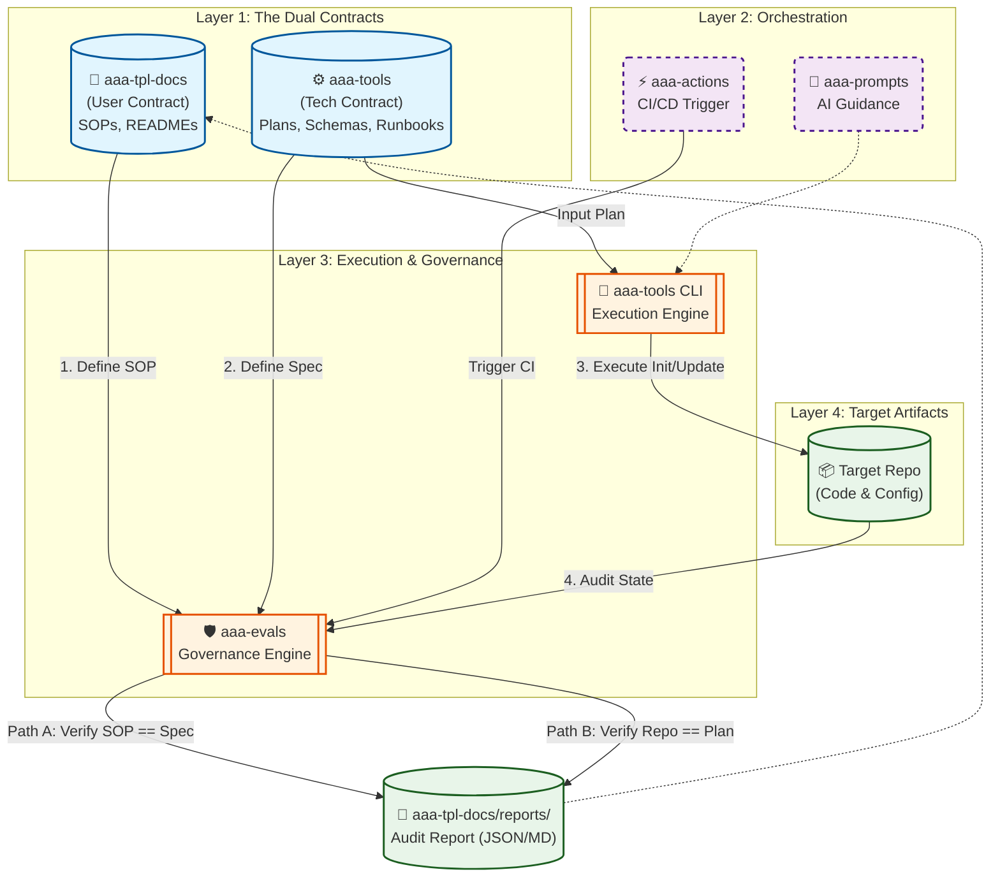

# AAA v0.4 Design (Governance Core + CLI Contract)

## Goal
同時完成兩條自動化路徑：
- **Path A**：文件一致性 → 自動驗證 → 報告
- **Path B**：初始化 → repo 建立 → policy 套用

並透過「雙層合約」確保人類 SOP 與機器可執行規格不再漂移。

## Architecture Overview
v0.4 建立一個雙層合約 (Dual Layer Contract) 模型：
- **使用者合約** 放在 `aaa-tpl-docs`，以 SOP 形式定義可執行步驟與授權節點。
- **技術合約** 放在 `aaa-tools`，以 CLI/Runbook/Plan/Schema 定義可驗證行為。

治理引擎由 `aaa-evals` 擴充一致性檢查，輸出可追溯報告至 `aaa-tpl-docs/reports/`。
`aaa-actions` 提供 **無狀態 (stateless)** 的 CI 入口，確保驗證結果可重複。

整體閉環：**合約定義 → CLI 具體化 → Evals 驗證 → 報告輸出**。

## Component Responsibilities
- **aaa-tpl-docs**：SOP/README/合約摘要，作為使用者可執行規範 (SSOT for human ops)。
- **aaa-tools**：CLI/Runbook/Plan/Schema 的技術合約與執行引擎。
- **aaa-evals**：一致性與合規驗證引擎，輸出報告。
- **aaa-actions**：CI 觸發與重現環境 (stateless)。
- **aaa-prompts**：SOP integrity / drift review 的 AI guidance。

## Automation Paths
- **Path A (Doc Consistency)**：SOP/README/Spec 一致性由 Evals 驗證並產出報告。
- **Path B (Init & Governance)**：
  - `aaa init` 依 plan/schema/runbook 執行初始化與政策套用。
  - **Post-init audit**：初始化後執行 `aaa-evals` 對 repo 狀態做稽核，形成閉環。

## Diagram (Mermaid)

## Definition of Done (v0.4)
- SOP/README/Runbook/Plan/Schema 的關鍵欄位一致性可被 Evals 驗證。
- CLI 初始化流程具備 post-init audit。
- CI 驗證流程為無狀態且可重現。
- 產出 v0.4 milestone report。
