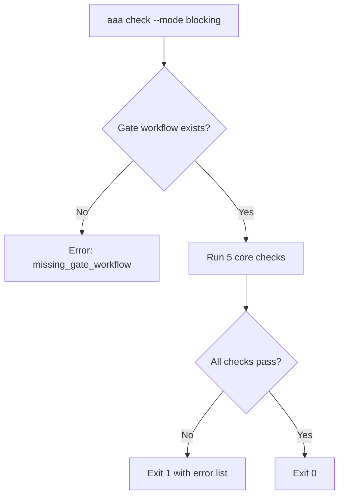

# AAA Checks Catalog

> **Purpose**: Complete index of all AAA governance checks  
> **Execution**: `aaa check --mode blocking`  
> **Location**: `aaa-tools/aaa/check_commands.py`  
| Check | ID | Purpose | Failure Impact |
|-------|------|---------|----------------|
| **README** | `readme` | Verify README.md exists | HIGH - Documentation missing |
| **Workflow** | `workflow` | Required workflows present | HIGH - CI missing |
| **Repo Type** | `repo_type_consistency` | repo_type matches manifest | MEDIUM - Misaligned config |
| **Manifest Alignment** | `checks_manifest_alignment` | Checks align with manifest | MEDIUM - Drift detected |
| **Orphaned Assets** | `orphaned_assets` | No orphaned files in assets | LOW - Cleanup needed |
| **AI Protocol** | `format_llm_support` | Support AI-centric semantic output | MEDIUM - Agent misalignment |

---

## What are Checks?

**Checks** are blocking governance validations that:
- ✅ **Block PRs**: Fail = PR cannot merge (when used in gates)
- ✅ **Deterministic**: Clear pass/fail criteria
- ✅ **Fast**: Typically <5s per check
- ✅ **Comprehensive**: Cover critical governance areas

**Difference vs Evals**:
- **Checks**: Blocking, production-grade, minimal
- **Evals**: Comprehensive, test suite, may include non-critical

---

## Core Checks (5)

**Command**: `aaa check --mode blocking`  
**Location**: `CHECKS` array in `check_commands.py` (Line 13-19)

| Check | ID | Purpose | Failure Impact |
|-------|------|---------|----------------|
| **README** | `readme` | Verify README.md exists | HIGH - Documentation missing |
| **Workflow** | `workflow` | Required workflows present | HIGH - CI missing |
| **Repo Type** | `repo_type_consistency` | repo_type matches manifest | MEDIUM - Misaligned config |
| **Manifest Alignment** | `checks_manifest_alignment` | Checks align with manifest | MEDIUM - Drift detected |
| **Orphaned Assets** | `orphaned_assets` | No orphaned files in assets | LOW - Cleanup needed |

---

## Gate Check (1)

**Location**: `run_blocking_check()` function (Line 62-70)

| Check | ID | Purpose | Failure Impact |
|-------|------|---------|----------------|
| **Gate Workflow** | `missing_gate_workflow` | Governance gate workflow present | CRITICAL - No enforcement |

**Verification**:
```python
verify_ci.has_reusable_gate(repo_root, workflow_ref)
```

**Default Gate**: `ai-asset-architecture/aaa-actions/.github/workflows/reusable-gate.yaml`

---

## Check Execution Flow



---

## Check Details

### 1. README Check
**Runner**: `aaa-evals/runner/checks/check_readme.py`  
**Validation**: `README.md` file exists in repo root  
**Error**: `check_failed:readme`

### 2. Workflow Check
**Runner**: `aaa-evals/runner/checks/check_workflow.py`  
**Validation**: Required CI workflows present  
**Error**: `check_failed:workflow`

### 3. Repo Type Consistency
**Runner**: `aaa-evals/runner/checks/check_repo_type_consistency.py`  
**Validation**: `.aaa/metadata.json` repo_type matches manifest  
**Manifest**: `aaa-actions/checks.manifest.json`  
**Error**: `check_failed:repo_type_consistency`

### 4. Checks Manifest Alignment
**Runner**: `aaa-evals/runner/checks/check_checks_manifest_alignment.py`  
**Validation**: Repo checks align with org-level manifest  
**Manifest**: `AAA_CHECKS_MANIFEST` env var or `aaa-actions/checks.manifest.json`  
**Error**: `check_failed:checks_manifest_alignment`

### 5. Orphaned Assets
**Runner**: `aaa-evals/runner/checks/check_orphaned_assets.py`  
**Validation**: No orphaned files in `.aaa/assets/`  
**Error**: `check_failed:orphaned_assets`

---

## Usage Examples

### Run All Checks (CLI)
```bash
cd my-repo
aaa check --mode blocking
```

**Output (Success)**:
```json
{
  "exit_code": 0,
  "errors": []
}
```

**Output (Failure)**:
```json
{
  "exit_code": 1,
  "errors": [
    "missing_gate_workflow",
    "check_failed:readme",
    "check_failed:orphaned_assets"
  ]
}
```

### Run in CI Workflow
```yaml
name: Governance Gate
on: [pull_request]

jobs:
  gate:
    runs-on: ubuntu-latest
    steps:
      - uses: actions/checkout@v4
      - name: Run Governance Checks
        run: aaa check --mode blocking
```

### Run Single Check (Advanced)
```bash
python aaa-evals/runner/run_repo_checks.py \
  --check readme \
  --repo /path/to/repo
```

---

## Check Configuration

### Environment Variables

| Var | Purpose | Default |
|-----|---------|---------|
| `AAA_EVALS_ROOT` | Evals runner location | `../aaa-evals` |
| `AAA_GATE_WORKFLOW` | Gate workflow ref | `ai-asset-architecture/aaa-actions/...` |
| `AAA_CHECKS_MANIFEST` | Checks manifest path | `../aaa-actions/checks.manifest.json` |

### Repo Type Support
Checks respect `repo_type` from `.aaa/metadata.json`:
- Different repos may have different check requirements
- Manifest defines repo_type-specific rules

---

## checks.manifest.json Structure

**Location**: `aaa-actions/checks.manifest.json`

```json
{
  "repo_types": {
    "docs": {
      "required_checks": ["readme", "workflow"]
    },
    "service": {
      "required_checks": ["readme", "workflow", "repo_type_consistency"]
    }
  }
}
```

---

## Error Codes

| Code | Meaning | Resolution |
|------|---------|------------|
| `evals_runner_missing` | `aaa-evals/runner` not found | Clone aaa-evals repo |
| `missing_gate_workflow` | No governance gate workflow | Add `.github/workflows/aaa-gate.yaml` |
| `check_failed:<check_name>` | Specific check failed | See check runner output |

---

## Troubleshooting

### Check Fails Locally but Passes in CI
- Ensure `AAA_EVALS_ROOT` points to correct location
- Verify `aaa-evals` repo is up-to-date

### Orphaned Assets False Positive
- Re-run `aaa init reindex-all-assets`
- Check for stale files in `.aaa/assets/`

### Manifest Alignment Fails
- Update `repo_type` in `.aaa/metadata.json`
- Sync with org-level `checks.manifest.json`

---

## Adding Custom Checks

1. **Create check runner**: `aaa-evals/runner/checks/check_my_check.py`
2. **Add to CHECKS array**: `aaa-tools/aaa/check_commands.py`
3. **Update manifest**: `aaa-actions/checks.manifest.json`
4. **Test**: `aaa check --mode blocking`

---

## Total Count

- **Core Checks**: 5
- **Gate Checks**: 1
- **Total**: 6 blocking checks

---

| 1.0 | 2026-01-28 | Initial catalog creation |
| 1.1 | 2026-01-28 | Added v1.1 AI Protocol (--format) & enrichment logic |

---

**Last Updated**: 2026-01-28  
**Version**: 1.1
  
**Source**: `aaa-tools/aaa/check_commands.py`
