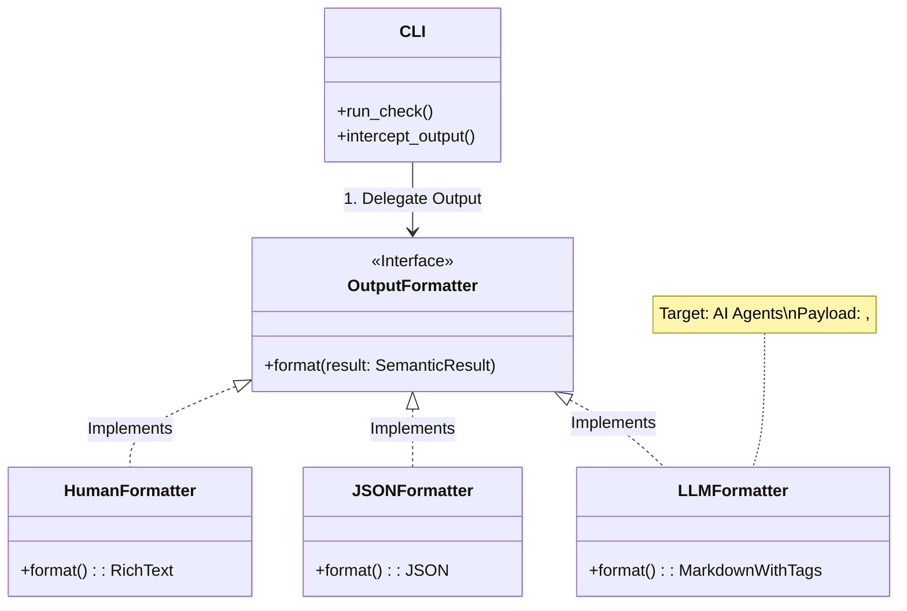
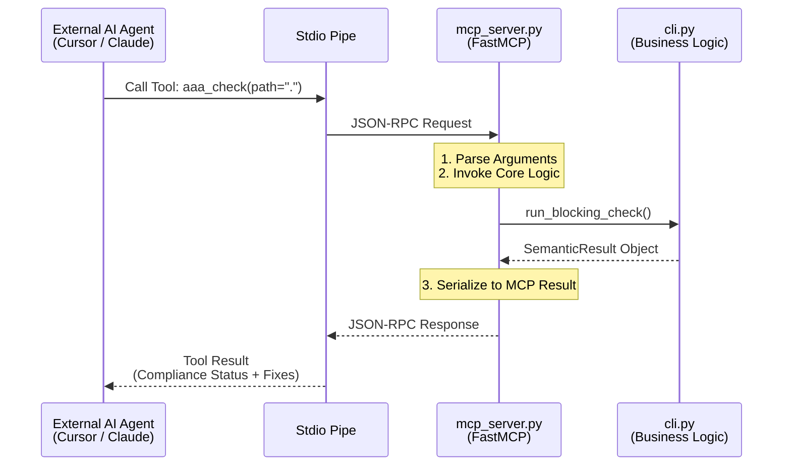

# v1.1 Pillar B: AI-Native Interface (Semantic Era)

## Goal Description
將 AAA 從「檢測工具」升級為「AI Agent 作業系統介面」。核心目標是透過 **語義化輸出協定 (AAA Output Protocol)**，讓 AI Agent (如 Cursor, Claude) 能夠精準理解 CLI 的失敗原因、背景規則，並獲得可執行的修補建議，實現 80% 以上的高成功率自主修正。

## Proposed Changes

### [aaa-tools]
#### [MODIFY] [check_commands.py](file:///Users/imac/Documents/Code/AI-Lotto/AAA_WORKSPACE/aaa-tools/aaa/check_commands.py)
- **數據完整化**：修改 `run_blocking_check`，從子進程獲取完整的 JSON `details` 而非僅布林值。
- **結構化回傳**：回傳內容對齊 `AAA Output Protocol`。

#### [NEW] [output_formatter.py](file:///Users/imac/Documents/Code/AI-Lotto/AAA_WORKSPACE/aaa-tools/aaa/output_formatter.py)
- **Adapter 模式**：實作 `LLMFormatter` 與 `JSONFormatter`。
- **Semantic Mapping**：內建 `ERROR_MAP`，將 `check_failed:readme` 轉換為：
    - 「規則：README 缺少 [## Purpose] 章節」。
    - 「後果：違反 AAA 企業級文件標準，阻斷部署」。
    - 「建議：`aaa pack fix readme` 或手動補齊」。

#### [MODIFY] [cli.py](file:///Users/imac/Documents/Code/AI-Lotto/AAA_WORKSPACE/aaa-tools/aaa/cli.py)
- **全域格式參數**：為 `aaa check`, `aaa run`, `aaa audit` 新增 `--format [human|json|llm]` 參數。
- **輸出攔截**：將所有 `typer.echo` 統一導向 `OutputFormatter`。

#### [NEW] [mcp_server.py](file:///Users/imac/Documents/Code/AI-Lotto/AAA_WORKSPACE/aaa-tools/aaa/mcp_server.py) [EXPERIMENTAL]
- **MCP Bridge**：實作一個基於 `mcp-sdk-python` 的 Stdio Server。
- **工具暴露**：將 `aaa check` 與 `aaa init` 封裝為 MCP Tools。

## Triple-Summary Protocol

### 1. Plan Summary
本計畫正式啟動 v1.1 的硬核部分：**語義化介面**。我們將解耦「執行邏輯」與「顯示邏輯」，確保 AAA 的輸出的對象不僅是開發者，更是 AI Agent。這將為 v2.0 的「自癒系統 (Self-healing)」打下關鍵的二進制/語義地基。

### 2. Schema Summary (AAA Output Protocol v1.1)
```json
{
  "status": "success | failure",
  "command": "check",
  "violations": [
    {
      "code": "SEM001",
      "severity": "blocking",
      "rule_reference": "file:///.../policies/test-coverage-policy.md",
      "message": "描述性訊息",
      "fix_suggestion": "修復指令"
    }
  ],
  "agent_context": "給 Agent 的專用 Prompt 片段"
}
```

### 3. Component Summary
- `OutputFormatter`: 多格式轉換核心。
- `SemanticMap`: 錯誤碼與自然語言的橋樑。
- `FastMCP (bridge)`: 實現 Cursor/Claude 直接對話工具。

## Design Architecture

### 1. Output Formatter Component Architecture


### 2. Output Protocol Data Flow
```mermaid
flowchart LR
    raw[Raw Check Result\n(Boolean / Error Code)] --> mapper[Semantic Mapper\n(Error Map Lookup)]
    
    mapper --> enriched[Semantic Result\n(Rule ID, Context, Fix Suggestion)]
    
    enriched --> switch{Format Strategy?}
    
    switch -- "--format=human" --> human[Rich Text / Table\n(For Developers)]
    switch -- "--format=json" --> json[Strict JSON Schema\n(For CI/Tools)]
    switch -- "--format=llm" --> llm[Semantic Markdown\n(For Agents)]
    
    subgraph "AAA Core"
    raw
    mapper
    enriched
    end
    
    subgraph "Presentation Layer"
    switch
    human
    json
    llm
    end
```

### 3. FastMCP Bridge Architecture (Experimental)


## Verification Plan
### Automated Tests
- `aaa check --format=json`: 驗證 Schema 完整度。
- `aaa check --format=llm`: 驗證 Markdown 標籤 (`<RULE>`, `<FIX>`) 是否正確產生。

### Manual Verification
- 使用一個刻意製造的錯誤（如刪除 README 章節），觀察 AI Agent 是否能根據 `--format=llm` 的輸出一次性修復成功。
